# vesuvius-topological-grid

**An ML-independent structural metric for Herculaneum scroll surfaces —
measure, arbitrate, detect, track, screen, orient, reconcile, unroll.**

Ancient writing has a grid: equally spaced lines, regular letter pitch,
columns on a module — like the structural grid of a building. If a
virtual unwrapping is correct, that grid survives; if it fails, the
grid breaks. This repository began as a few small tools built on that
observation, and has grown into a set of geometry instruments for the
same mission: none of them reads text, and there is no ML anywhere in
the chain.

**What is input and what is produced here.** The PHerc1218 per-ray
crossing table and per-slice origins are an **external input**
(iyando's convention and script, Jinhojeong's run — credit and
provenance in mode 16). This repository does **not** detect windings
from raw CT; it reconstructs and analyses geometry from those published
crossings, and validates the results against the raw CT volume where
that is possible.

**Evidence levels used throughout:**
`SYNTHETIC` (twin/bench with planted truth) · `REAL-DERIVED` (built
from published real-scroll data) · `RAW CT` (checked directly against
the CT volume) · `THIRD-PARTY` (validated against another
contributor's ground truth).

## Results on real scroll data

- **PHerc1218 unrolled**: 5.13 m of continuous ribbon, 78 usable
  windings (≥95 traced), pitch 0.20 mm/turn, with a coverage census
  showing exactly where segmentation survives (mode 16). `REAL-DERIVED`
- **One folding law for the whole scroll**: the crush relief is
  separable; in a held-out exam it predicts hidden geometry at
  RMSE/σ = 0.58 (mode 17). `REAL-DERIVED`, negative bench included.
- **The collapse measured point by point**: 1.35M crossings mapped to
  the flat sheet and an ideal spiral; displacement median 1.2 mm,
  p95 5.9 mm (mode 18). `REAL-DERIVED`
- **Frame cross-validated**: blind self-registration recovered the
  official per-slice origin to ~10 voxels; convention confirmed by its
  operator, with an offered back-projection (mode 18). `THIRD-PARTY`
- **Fiber striations seen inside a closed scroll** (Paris 4), with a
  full impostor-control chain — and their absence in PHerc1218,
  double-controlled (mode 15). `RAW CT`, positive and null.
- **Two placebo-controlled nulls that save others the attempt**:
  no mirrored ink transfer at ~19 µm/px (mode 14); no layer-locked
  brightness signal in PHerc1218's crushed interior at 17 µm
  (mode 18). `RAW CT`

## What has actually been tested

| Mode | Question | Data | Evidence | Status |
|---|---|---|---|---|
| 1 | Does the scribe's spatial grid survive on a rendered surface? | Paris 4 renders | REAL-DERIVED (two independent implementations replicate: pitch 4.16 mm, column period 43.0 mm) | supported (pitch later refined, see mode 7) |
| 2 | Where do two ink models disagree on the same region? | multiple renders | REAL-DERIVED (consensus + divergence maps) | instrument |
| 3 | Can buried ink emerge by stacking lines at the detected period? | synthetic + clean model output | SYNTHETIC (gain ×2 at 4× noise with ~20 lines) | prototype, limits stated |
| 3B | Can period and phase be tracked on raw intensity (epoch folding)? | raw surface intensity | REAL-DERIVED (4 exams PASS; period to 0.1% at SNR 0.3) | supported |
| 4 | Which segmentation candidate preserves the grid best? | candidate renders | REAL-DERIVED (wobble punished −24%; rotation margins ~3%, declared thin) | supported, inconclusive on close scores |
| 5 | What is the local baseline tilt? | Paris 4 renders | REAL-DERIVED (median error 0.00°, max 1.37° vs imposed rotations) | supported (saturates beyond ±45°) |
| 6 | How many windings should a ray cross, voids included? | synthetic pathology + full 1218 (1.46M crossings) | SYNTHETIC + REAL-DERIVED (void-aware ratio 1.00 where naive drops to 0.70); adopted unchanged by an independent contributor | supported, THIRD-PARTY use |
| 7 | What does geometry imply for work size and text placement? | twin + real scroll | SYNTHETIC + REAL-DERIVED (8 acceptance tests PASS; two failed designs documented) | supported with caveats |
| 8 | Where does papyrus crack under the measured crush? | measured 2:1 section, plate theory | REAL-DERIVED (neutral angle 37.64°, strain ratio 3.39×) | **claim tested and withdrawn** on real labels — kept as documented failure |
| 9 | What work size does a measured section imply? | measured sections + catalogue | REAL-DERIVED (forward→inverse roundtrip exact; column period vindicated on the Grand Prize render) | supported (Greek prose band 47–98 columns) |
| 10 | Can the in-plane flattening be undone? | 1218 crossings | REAL-DERIVED (residual 0.2–0.33 mm, transfers across windings) | supported |
| 11 / 11B | Do nested windings deform under one law? | 1218 crossings + raw CT | REAL-DERIVED + RAW CT (multiwinding collapse 1.000→0.952; raw-CT reconstruction check) | supported |
| 12 | Digital twin with planted ground truth | synthetic | SYNTHETIC (exam suite A–G) | instrument |
| 13 | Can double-thickness (kollesis) be detected? | twin; real pre-flight | SYNTHETIC (3 exams pass); real run **not attempted**: the crossing table carries no thickness (declared stop) | validated on twin only |
| 14 | Is there mirrored ink transfer (sovrapposti)? | twin + Paris 4 GP 2.4 µm | SYNTHETIC pass + REAL placebo-controlled null | **null** at ~19 µm/px |
| 15 | Are papyrus fiber striations visible in CT? | Paris 4 render + 1218 raw CT | RAW CT | Paris 4 **yes** (control chain); 1218 **no** (double-controlled) |
| 16 | Can the scroll be unrolled from the crossings? | 1218 crossings | REAL-DERIVED (ribbon + coverage census) | supported |
| 17 | Is the crush relief one shared law (ironing field)? | 1218 crossings | REAL-DERIVED, held-out wedge exam 0.58; negative bench 0.98 | supported |
| 18 | Can every label go back to its origin? | 1218 crossings + raw CT | REAL-DERIVED + RAW CT texture + THIRD-PARTY frame | supported; brightness null documented |

## Map of the repository

- **A. Measurement & QA on real data** — modes 11B, 16, 18
- **B. Synthetic instruments & benches** — modes 12, 13 (+ the benches
  inside 14, 17, 18)
- **C. PHerc1218 geometry** — modes 10, 11, 16, 17, 18
- **D. Real-scroll experiments, positives and nulls** — modes 14, 15,
  and the texture chain in 18
- **E. Open threads** — the 1.129 µm Paris 4 mesh; the per-voxel unwrap
  (proposed to the labels' author); the thermal-tempering hypothesis

Mode numbers are stable identifiers and keep their original
(chronological) order below; this index is the thematic map.

---

## Scope and method

This repository does not trace surfaces, does not flatten better than
[flatboi](https://github.com/ScrollPrize/villa/blob/main/volume-cartographer/libs/flatboi/flatboi.cpp),
does not fit spirals better than
[fit_spiral](https://github.com/ScrollPrize/villa/blob/main/volume-cartographer/scripts/spiral/fit_spiral.py),
and does not detect ink at all. Those problems have teams and tooling.
What it does is **measure** — properties of the roll itself and of the
segmentation that produced its geometry: winding pitch, fusion rate,
crush ratio, unrolled length, per-point collapse displacement, where
the segmentation stops being trustworthy, whether a period is real or
an artefact of the band it was searched in. Its inputs are declared
above; its instruments are built and examined on a synthetic twin with
planted ground truth before touching real data, and validated against
raw CT and third-party ground truth where possible — with no ML
anywhere in the chain.

That is a narrow niche, and it is a stated one: the project's own
[open-problems page](https://scrollprize.org/2026_open_problems) says
twice that "we do not always know which part of the pipeline is
limiting us" and that "better diagnostics matter just as much as better
models". Everything here is aimed at that sentence. Every mode ships an
acceptance test written before the answer was known, and several of
those tests have failed and are documented where they failed (see
`LOGBOOK.md`).

---

## 1 — Measure (`scripts/grid_metric.py analyze`)
Detects the scribe's spatial signature on a rendered surface via windowed spectral
prominence, with **cycle gating** (a component only enters a window's score if the
window holds ≥3 cycles of its period — see *Lessons*, below).

On the public PHerc. Paris 4 surfaces it recovers, unsupervised:
- letter pitch **4.16 mm** and column period **43.0 mm** — replicated exactly by two
  independently written implementations;
  (*The 4.16 mm value is historical and superseded; use 1.83 mm for all production runs, or omit the flag to let the script measure it).
- line spacing measured *spatially, per column* (~2–4 mm, wide spread on 13 mm strips
  — the uncertainty is part of the result).

## 2 — Arbitrate (`scripts/grid_metric.py compare`)
Two ink-detection models render the same region differently. Running the metric on
both yields a **consensus map** (both see structure) and a **divergence map** (they
disagree) — a prioritized review queue for hallucination auditing. The metric measures
text-*likeness*, not truth: divergence tells a papyrologist where to look first, not
who is right.

## 3 — Detect (`scripts/epoch_folding_prototype.py`)
Epoch folding, borrowed from pulsar astronomy: stack N text lines at the detected
period and buried ink structure emerges (~√N gain). Folding averages lines together,
so it **destroys text by construction — it detects the presence of structured writing,
it cannot read it**. Validated under controlled noise burial (gain ×1 on clean model
output, ×2 at 4× noise with only ~20 lines). Intended target: raw surface intensity,
where a period–phase fold search (pulsar-style) is the natural next step.

## 3b — Search & Track (`scripts/phase_tracking.py`)

Mode 3 states its own limit in its docstring: line centres are found on a
*clean* image, and on real raw data the algorithm
must **search** for the period and phase by maximizing the contrast of the
folded profile — "that search is the natural next step". This is that step,
and it turned up something the prototype was throwing away.

```bash
python scripts/phase_tracking.py search IMAGE.png --width-mm 129 --axis lines
python scripts/phase_tracking.py track IMAGE.png --width-mm 129 --plot phase.png
python scripts/phase_tracking.py test
```

**The search.** Classic epoch folding: for each trial period, fold the
profile and score it with the chi-square of the folded bins against a flat
one. The true period maximizes it. No peak-finding on a clean image, no
assumed period, and it degrades gracefully instead of collapsing — it
recovers a 2.79 mm lattice to 0.1 % at SNR 0.3, where peak-finding on the raw
profile has nothing to work with.

**What the prototype discarded.** `fold_lines` already walks the image in
windows and computes line centres in each one — then averages every strip
together, throwing away *where each window sat*. That per-window phase is a
signal in its own right. In an intact surface it drifts slowly and smoothly;
a discontinuity in the underlying surface displaces the text and **steps**
it. A phase glitch, in the pulsar-timing sense.

### A glitch is not a drift

This distinction is the whole tool. Writing that sits slightly skew to the
roll axis produces a phase that drifts **linearly** across the render — three
whole periods in the test case, and entirely innocent. A surface
discontinuity produces a **step**. The drift is fitted and subtracted before
anything is called a glitch, and exam C enforces it: if a pure linear drift
raises even one glitch, the tool is reporting skew as damage and fails.

### Which axis says what

| `--axis` | period | what a jump to a neighbouring winding does |
|---|---|---|
| `columns` | ~43 mm, along the unrolled arc | **steps** — a skip displaces text by roughly one circumference, not a multiple of the column period |
| `lines` | ~2.79 mm, along the roll axis | **need not move at all** |

The asymmetry matters and is easy to get backwards. The scribe wrote on a
flat sheet, so lines sit at the same height on every winding; only skew moves
them. **A clean line phase is not evidence of an intact surface.**

One practical caveat, worth more than the code in some cases: a render
carrying only ~10 column periods gives the search very little along that
axis. Where the periods are few, locating the blank intercolumn bands
directly and checking the sequence of gap-to-gap distances is more robust and
needs none of this. This tool earns its place where the periods are many and
the signal is buried — the raw-intensity case mode 3 was always aimed at.

### Validation

| exam | criterion | result |
|---|---|---|
| A — period under noise | recover a known lattice to < 2 % at SNR 0.3, where peak-finding fails | **0.1 %, PASS** |
| B — glitch localized | exactly one glitch within one window of truth; a clean control raises none | **21.1 vs 21.0 mm, 0 control, PASS** |
| C — drift is not a glitch | a 3-period linear drift must raise **zero** glitches | **0, PASS** |
| D — harmonic rejection | recover the fundamental where 2P genuinely scores higher, **and** show the search picks 2P with rejection off | **2.786 vs 5.583 mm, PASS** |

Exam D was rewritten because its first version was vacuous: with a plain
second harmonic the search returned the right answer with rejection switched
off, so the exam could not fail. It now checks both halves — the fix, and
that the fix was needed.

Exam B failed on the first run for a reason worth keeping: the analysis
window was sized from the lattice period, which runs along the *perpendicular*
axis. For line spacing on a narrow render that came out wider than the whole
image, so exactly one window fitted and there was no track to glitch. Window
size belongs to the walking direction.

---

## 4 — Screen (`scripts/grid_metric.py rank`)
Given several candidate renders of the **same region** (e.g. alternative segmentation
parameterizations), `rank` scores each by how well the scribe's grid survives and
orders them — a selective screen, never a generator: it ranks existing candidates, it
does not place windings (see the pitch-variability caution raised by sean bruniss in
the community threads).

**Scoring.** Axis-aligned 2D-FFT cross energy, ring-normalized: grid energy must sit at
the scribe's frequencies *and* square to the page. Rotation moves the peaks off-axis,
line-wobble warp smears them; each peak is compared to its own frequency ring, so
resampling smoothness cancels out. Aggregation is by median across windows.

**Reference signature is external by design** (workshop-standardization principle):
known corpus values are passed in via `--letters-mm/--lines-mm`, or measured once on a
trusted source — never calibrated from the candidate pool, so degraded candidates
cannot contaminate the ruler.

**Validation.** The acceptance test ships in the repo (`scripts/make_rank_candidates.py`):
one real Paris 4 strip plus rotated, line-wobbled and noisy copies; the original must
rank first. Current status, kept honest:

| exam | result |
|---|---|
| order (original first) | **passes** |
| line-wobble warp (classic unwrap error) | punished −24 % |
| rotation / noise | below original, thin margins (~3 % median vs rotation) |

The thin rotation margin is expected physics on a 13 mm strip (letter pitch is nearly
rotation-invariant; the discriminating line component is cycle-starved) and should
widen on taller strips. **Use accordingly:** trust `rank` to flag clearly broken
geometry; treat close scores as inconclusive; it does not arbitrate between two good
candidates. Two earlier scoring designs failed this same test (1-D projections; pooled
calibration); their diagnoses are preserved in the commit history — the acceptance test
is the gate, and it stays in the repo.

## 5 — Orient (`scripts/grid_metric.py orient`)

Maps the local tilt of the writing baseline across a surface, by rotating the
analysis axis and finding the orientation of maximum grid coherence.

```bash
python scripts/grid_metric.py orient IMAGE.png --width-mm 129 \
    --letters-mm 1.83 --lines-mm 2.79
```

The point is independence: this reads **text layout**, whereas structure-tensor
methods read **CT intensity**. Two estimators of the same local geometry through
unrelated physics, so systematic disagreement between them is a cheap mesh-QA
signal — and neither needs labels. On the public Paris 4 surfaces the baseline
tilt swings from −9° to +6° across the strip: the deformation of the sheet
showing up directly in the orientation of the text.

**Validation.** `scripts/orient_acceptance_test.py` measures each window's own
baseline tilt, imposes a known rotation, and checks that the recovered angle
minus the baseline equals the imposed one. That subtraction is the whole test —
without it, every window's own tilt reads as a constant error and the estimator
looks broken. Pre-registered criteria and results on a real Paris 4 surface
(4 windows × 7 imposed rotations):

| criterion | threshold | result |
|---|---|---|
| median \|error\| | < 1.0° | **0.00°** |
| max \|error\| | < 2.0° | **1.37°** |
| bias (mean error) | < 0.5° | **+0.09°** |

**Two declared limits.** The search saturates beyond `±span_deg` — raise it for
strongly tilted surfaces, but stay well inside ±45°, where a rotation swaps the
roles of the letter and line components. And the absolute zero is the image
grid, not the scroll axis: compare tilts between surfaces, never absolute
angles.

---

## 6 — Reconcile (`scripts/void_aware_expected_n.py`)

Layer-count QA compares how many windings a ray crosses against how many it
*should* cross. The naive expectation, `span/pitch + 1`, assumes compact
winding — false on a crushed scroll, where internal voids inflate the span and
drive the ratio far below 1 for reasons that have nothing to do with labeling
quality.

This reformulates the expectation so that voids contribute nothing: each gap
explains the crossing on its far side, so a void contributes exactly one
expected winding (its far boundary) and nothing for the empty interior. In
short: **don't count the air.** The residual then isolates labeling pathology —
below 1 means merge excess, above 1 means fragmentation.

```bash
python scripts/void_aware_expected_n.py                    # acceptance test
python scripts/void_aware_expected_n.py --csv cells.csv    # aggregate-bound demo
```

**Validation.** The acceptance test injects each pathology into synthetic rays
and checks the estimator separates them: with 30% injected voids the naive
ratio collapses to 0.70 while the void-aware ratio holds at 1.00; merges read
below 1, fragmentation above 1, and merge detection survives voids.

**In production.** Run over the full PHerc1218 per-ray positions (1.46M
crossings, 21,070 cells) by another contributor, the acceptance test passed
unchanged on their machine before anything else ran. Two findings came out of
it: fragmentation-excess cells line up with slab boundaries — independently
re-detecting a labeling edge effect found by a different method — and merge
excess concentrates on the flattened axis of the scroll.

**Declared limits.** A run of ≥3 consecutive merged windings looks like a void
from positions alone; `v_void` is the knob, CT intensity the disambiguator.
Duplicate crossing positions (rounded centroids) are deduped inside the
function — a field report from the full-scroll run.

---

## 7 — Twin & Predict (`scripts/synthetic_scroll_twin.py`, `scripts/text_layout_predictor.py`)

Two scripts, **one geometry**: a scroll is a single sheet wound on an
Archimedean spiral, so `column k → (turn, θ, r)` is fixed once four numbers
are — winding pitch, crushed section, column period and the lead-in before
column 1. Two are on firm ground: the section (42 × 21 mm, cross-confirmed) and the
column period (43.0 mm), which the Grand Prize render **vindicates** — 571 px
period against a 24.4 px letter pitch, consistent with 16 letters counted in
68 % of the period. What the same measurement breaks is the **letter pitch**:
4.16 mm is out by a factor 2.27, because `BAND_LETTERS` started 8 % above the
true value and the search could not reach it. See `docs/data_sources.md`,
"Grid self-consistency". The
mean pitch is corroborated for this scroll (iyando's 173 and the winding
atlas's 172.8 for PHerc1218 agree) but the *local* wrap-to-wrap pitch is not
usable at all, and the lead-in is assumed. Run `sensitivity` before quoting
any figure that depends on them. The twin runs that geometry
**forward** to fabricate ground truth; the predictor runs it **outward** onto
the real scroll with the uncertainty attached. Neither is allowed to do the
other's job, and the distinction is the whole point:

| | twin (`synthetic_scroll_twin.py`) | predictor (`text_layout_predictor.py`) |
|---|---|---|
| input | a work → the scroll builds itself around it | a work + measured geometry |
| output | per-letter ground truth, wound and crushed; voxel volumes | a falsifiable map with σ, horizon, calibration |
| tests | the toolchain | the unwrapping |
| may claim | nothing about the real scroll, bar two conditioned statements below | everything, because it can be wrong |

The measured PHerc1218 parameters and their provenance are documented in
[`docs/data_sources.md`](docs/data_sources.md#pherc-1218--geometry-used-by-mode-7-twin--predict).
They are **inputs, not results**: if one is wrong, both scripts are wrong
with it.

```bash
python scripts/synthetic_scroll_twin.py build --columns 95 --script greek
python scripts/text_layout_predictor.py predict --columns 95 --csv map.csv
```

Both scripts run on geometry alone — no input images. Full command set,
including `sweep`, `kollesis`, `volume`, `calibrate` and the acceptance
tests, in [Quick start](#quick-start) steps 10-16.

### The twin: self-adjusting to the work

Give it a work and it builds the scroll around it. The work fixes the sheet
length; the sheet fixes the turns and the outer radius (spiral from a fixed
~4 mm umbilicus); ink lands on the grid the code carries (letter 4.16 mm, lines
2.79 mm, columns 43 mm, page 200 mm — the first two are the historical pair,
contradicted by the render check below and flagged by `grid_warnings()` at
runtime; pass `--letter-mm 1.83 --line-mm 3.69` for any production figure); then the whole thing is **crushed to the
measured deformation** — every turn mapped, arc-length preserving, onto a 2:1
ellipse of equal perimeter, folds at 0°/180° as measured on PHerc1218. Every
letter's position before and after crushing is known because we put it there:
**perfect ground truth**, per letter.

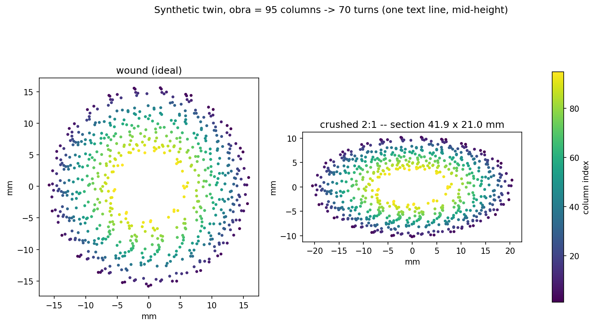

*One text line of a 95-column work, before and after the crush. Colour is the
column index; the section lands at 41.9 × 21.0 mm against 42 × 21 measured.*

`--fuse` collapses chosen turns over a chosen sector (verified: a 5-turn weld
drops ray crossings from 58 to 55 — the merge pathology `void_aware` must flag
at ratio < 1). `--fibers` adds crossed recto/verso striation, giving the
fiber-detector idea its first 3D target without the raw CT.

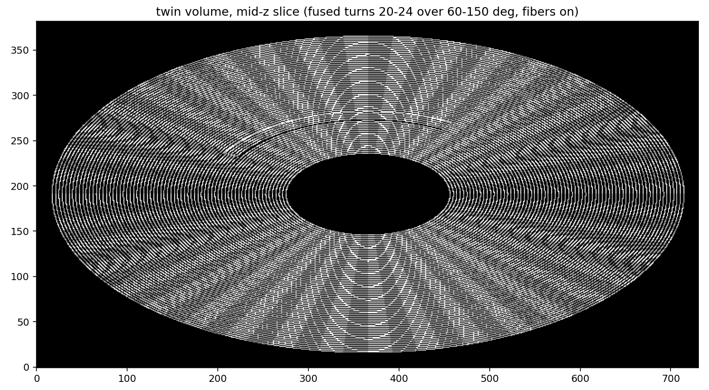

*Mid slice of the twin volume with finite-thickness sheets: contact on the
flattened axis, open gaps at the folds. Right: a kollesis join, with the
exported `kollesis_mask` ground truth overlaid in red.*

#### Layout regime: the frontier is prose vs verse, not Greek vs Latin

The geometry does not know Greek. `--script greek | latin-prose | latin-verse`
changes what matters:

- **Prose in scriptio continua** — the scribe adapts to the column, which is
  the workshop module. Latin behaves like Greek here, only with narrower
  rustic capitals.
- **Verse** — the metre fixes the line and **the column period becomes a
  consequence**, with a ragged right edge. This is not academic for
  Herculaneum: the Latin papyri there are mostly verse (Carmen de bello
  Actiaco, Ennius, Lucretius, Caecilius Statius); the main prose one is
  PHerc 1067.
- **Interpuncts** — present in the Carmen, gone from Latin books by ~150 AD.
  A mark every ~5–6 letters, a quasi-periodic component at ~1–2 cm that Greek
  scriptio continua simply does not have.

Both are **discriminators for `grid_metric`, not noise**: in verse the letter
component survives while the column-period component is smeared by the ragged
edge, and interpuncts add a line Greek cannot produce. And the regime changes
what the section implies — same measured 42 × 21 mm section:

| regime | column period | implied work |
|---|---|---|
| Greek prose | 43 mm | **95 columns**, 69.7 turns |
| Latin verse (hexameter) | 98 mm | **42 columns**, 70.0 turns |

> ⚠ Only the Greek grid is measured (Paris 4, replicated). The Latin metrics
> are **declared placeholders** — the tool prints a warning and they must be
> overridden with `--letter-mm` / `--line-mm` before any number from them is
> quoted.

#### Which axis the crush deforms — and which grid numbers survive it

The roll is flattened in the plane **perpendicular to its axis**. That splits
the writing grid in two, and the split decides how much each number can be
trusted:

- **Line spacing runs along the roll axis.** The crush does not act in that
  direction, so neither does any error in undoing it. Whatever an unwrapping
  gets wrong, it does not stretch the line-to-line distance. This is why
  ~2.79 mm is the firmest of the three — and it is also the only one
  estimated in the spatial domain rather than by FFT.
- **Letter pitch and column period run along the wound arc**, inside the
  crushed plane. They are exactly the quantities an unwrapping can distort,
  and they are the two that drive the column count and the character count.

In the twin the sheet is inextensible and the crush is arc-length preserving
(exam A), so nothing is intrinsically stretched — what changes is where a
point lands and how the layers *appear* in a slice. Real papyrus does deform
inelastically; that is not modelled, and it is a declared limit.

A useful discriminator falls out. A uniform horizontal scale error would move
the letter pitch and the column period **together**. The column period
(43.0 mm) is plausible as it stands, which argues against a large scale error
and points instead at a harmonic misidentification of the letter pitch alone.
(The same split has a physical consequence for the material, not just for
the measurement — see mode 8, where the curvature field of the crushed
section predicts where the sheet cracks, where it merges, and where it is
left untouched.)

`scripts/band_sensitivity.py` settles it: it sweeps the search band and
reports whether a detected period is a property of the image (STABLE) or of
the band we chose to look in (TRACKING / JUMP). Both `BAND_LETTERS` and
`BAND_COLUMNS` currently return values within ~10 % of a band edge; only the
line spacing sits comfortably interior.

#### The grid, measured on the render

The scale-free check that settled it, and the numbers the twin now carries:

| | before | after | normal for Herculaneum |
|---|---|---|---|
| letters per line | 7.9 | **16** | 15–25 |
| lines per column | 54 | **41** | 25–40 |
| letter pitch | 4.16 mm | **1.83 mm** | — |
| line spacing | 2.79 mm | **3.69 mm** | — |
| characters per column | 426 | **649** | — |

The decisive figure was a **ratio**, so no calibration argument could touch
it: column period / letter pitch measures **23.4** on the render against the
**10.3** implied by 43 / 4.16. The count is not a clean read, so it was run at
15, 16 and 17 letters — the discrepancy holds at 2.1–2.4× throughout. Details
and the failure mechanism in [`docs/data_sources.md`](docs/data_sources.md),
"Grid self-consistency".

Two cautions that came out of measuring it, both worth carrying:

- **Counting letters needed a human.** An autocorrelation of the line profile
  peaks at the *stroke* spacing, not the letter spacing — Greek majuscule puts
  two or more verticals inside a single Π, Η, Μ or Ν, and that periodicity is
  stronger than the letter one.
- **Do not expect round numbers.** Everything here is in millimetres, a unit
  from 1793 applied to a first-century-BC hand. In Roman digiti the grid is
  2.32, 1.58, 0.20, 0.099 — nothing round, because there was no rule on the
  scribe's table. Where ancient units *do* bite is the sheet, which was
  manufactured and sold: Pliny's papyrus grades run 13/11/9/6 digiti
  (240/204/166/111 mm), and intact rolls stand 190–240 mm tall — 10–13 digiti,
  whole units. **What was purchased is in ancient units; what the hand made is
  not.**

#### Kollesis: the Egyptian manufacture is in the geometry

No Egyptian-language text is plausible at Herculaneum — it is a Greek
philosophical library with a Latin appendix. But the **support** is Egyptian
by definition, and that leaves a structure the twin now models. The roll is
not one sheet: it is kollemata glued with an overlap. Pliny (NH XIII) has the
scapus at no more than twenty sheets, about 11–12 feet — sheets of ~17–19 cm.
Each join is a band of **double thickness every ~160 mm of arc**.

This matters because it is **detectable by thickness alone, with no ink
model** — the natural registration landmark for unwrapping. And its signature
is not imitable by software artefacts: consecutive joins sit a *fixed arc*
apart while the local circumference *grows* with radius, so the angular step
between successive joins shrinks monotonically outward — an **angular chirp**.
A slicing artefact is constant in index; a manufacturing periodicity chirps.

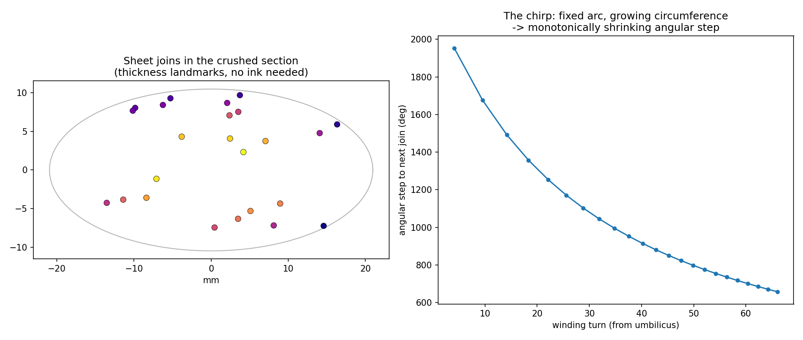

*Left: the sheet joins of a 95-column twin placed in the crushed section —
thickness landmarks, no ink needed. Right: the chirp. Fixed arc, growing
circumference, so the angular step to the next join falls monotonically
outward. (Figure rendered with the earlier 180 mm sheet default; at the
measured 160 mm the join count is ~12 % higher.)*

**The arithmetic that followed has since been answered, and the answer was
the dull one.** A 4.43 m roll exceeds Pliny's scapus of twenty sheets, which
looked like it needed explaining. It does not: Philodemus' *On Poems* II "was
at first a roll of 70 sheets; a further 30 were glued on when the work proved
to be long". Gluing scapi together was ordinary practice. That roll also
supplies the **measured** sheet width — 16 m over 100 kollemata, i.e.
**160 mm** — which the twin now carries as its default; at 160 mm the 4.43 m
roll is 27.7 sheets.

### The predictor: the map, with the uncertainty attached

The same geometry aimed at the real scroll — *"column 30 should sit on turn
22, near 140°"* — falsifiable by construction against where an ink model
actually finds letters. Nothing is fitted to the data it will be tested
against. Monte Carlo over pitch (per-turn random walk), outer radius and
lead-in, with circular statistics for θ. Two regimes fall out, and the tool
reports which one it is in:

| regime | what is informative |
|---|---|
| uncalibrated (lead-in σ ≈ one circumference) | **turn index only** — θ is uniform from column 1 |
| calibrated (2–3 anchor columns) | θ to ~10 columns depth, confident turns far deeper |

`calibrate` is the self-regulating loop: feed it columns already located by
ink detection, it fits (pitch, lead-in, θ₀) by least squares and tightens the
map for every *other* column. Predict → anchor → re-predict.

Reading direction is encoded in both scripts: the text **start is outermost**
— the end-title sits deepest, exactly where the PHerc139 subscriptio was
found.

### What the twin may claim about the real scroll

A synthetic twin proves the tools work on the twin's assumptions, nothing
more — it is a test bench, not a microscope. Two statements are allowed out,
and both carry their conditions.

**1. The section constrains the length of the work — once a pitch and an
umbilicus are assumed.** Inverting the measured 42 × 21 mm section gives ~95
columns of Greek prose. But neither of the two inputs that figure depends on
is measured on PHerc1218 here, and both move it materially. Run `sensitivity`:

| assumed umbilicus r₀ | implied work | implied turns |
|---|---|---|
| 3.0 mm | 99 columns | 76.3 |
| **4.1 mm** (default) | **95 columns** | **69.7** |
| 6.0 mm | 87 columns | 58.8 |

| pitch | what it is | implied work | implied turns |
|---|---|---|---|
| **173 µm** | **PHerc1218: iyando's stitched 173 and the winding atlas's 172.8 for this scroll, agreeing** | **95 columns** | **69.7** |
| 187.3 µm | the atlas *median over 36 scrolls* — a collection statistic, not a 1218 value | 88 columns | 64.7 |
| 207 µm | the same median before the merged-sheet level correction | 78 columns | 58.2 |

Because the turn count is a function of r₀ once the section and pitch are
fixed, the section cannot corroborate the winding count — it is not an
independent check. The useful statement runs the other way and is falsifiable
outside the model: **if the winding count is ~70 and the pitch is 173 µm,
the umbilicus must be ~4.1 mm**, which the core in the raw CT confirms or
kills.

**2. Crushing spaces the layers anisotropically — and this one is free of
those assumptions.** Equal-perimeter 2:1 ellipses sit ~2× further apart along
the fold axis than along the flattened axis, where the gap falls *below* the
nominal pitch. The twin therefore predicts merge excess concentrated on the
flattened axis, which is what the void-aware run found on the real scroll.
It follows from the 2:1 ratio alone — cross-confirmed by two independent
quantities — not from the pitch or the umbilicus. Only the absolute figures
(~240 µm / ~120 µm at a 173 µm pitch) scale with the pitch.

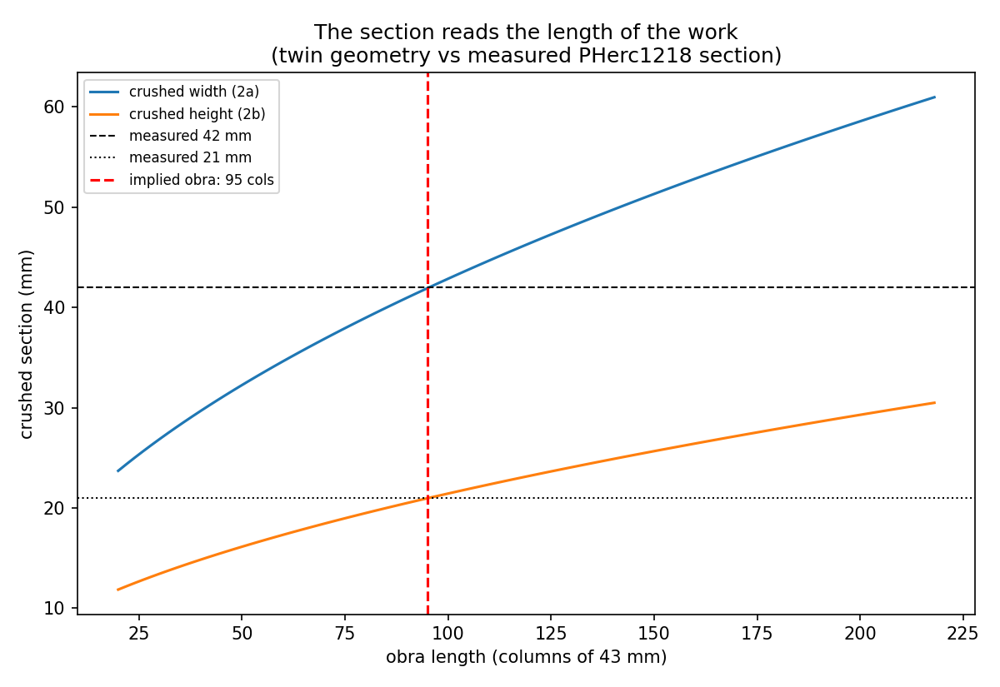

*The section reads the length of the work, once a pitch and an umbilicus are
assumed. The layout regime sets the column period, so the same section means
95 columns of prose or 42 of hexameter.*

### Validation

Acceptance tests ship inside each script, criteria pre-registered.

**Twin** (`test`, run on a 72-column twin — the 95-column figures above give more
joins for the same reason: the work sizes the roll):

| exam | criterion | result |
|---|---|---|
| A — inextensibility | crushed perimeter = wound circumference per turn, rel. err < 0.1 % | **4.6e-10, PASS** |
| B — ground-truth round trip | analytic un-crush recovers every letter's s to < 10 µm | **0.00 µm, PASS** |
| C — umbilicus inversion | the inversion round-trips to < 0.1 turns, **and** r₀ is shown to be a free parameter (3–6 mm spans > 10 turns) | **0.000 turns, 18-turn spread, PASS** |
| D — kollesis chirp | join count = L/W; angular step monotone > 98 % | **21 joins (21.5 sheets), 659°→1806°, 100 %, PASS** |

**Predictor** (`test`):

| exam | criterion | result |
|---|---|---|
| A — round trip (no noise) | max \|Δθ\| < 0.5°, turns exact | **0.000°, PASS** |
| B — coverage (blind, 120 independent worlds) | 1σ coverage 0.55–0.90; turn hit > 0.85 where confident | **0.61 / 0.91, PASS** |
| C — self-regulation (s0 off 120 mm, pitch off 4 µm, 3 anchors) | held-out θ error halved; pitch within 2 µm | **111.8° → 0.2°; 177.3 vs 177.0 µm, PASS** |

Exam C of the twin was originally written as a three-way consistency check:
the measured section implies ~70 turns, "against ~70 measured independently".
It was circular. With the section and the pitch fixed, the turn count is a
function of the umbilicus alone, and the umbilicus had been chosen to make 70
come out. The exam passed every run because it could not fail. It is now an
umbilicus inversion, and it explicitly tests that the umbilicus is a *free*
parameter — a test that the earlier framing was unfounded. The general lesson
is the one this repository keeps relearning: an acceptance test that cannot
fail is not an acceptance test.

Three failed designs are kept in the docstrings on purpose: coverage measured
across columns of one world instead of across worlds (nearly binary — all
columns share one parameter draw); a first production run returning a
zero-column θ-horizon (not a bug — the honest headline that angles are earned
through anchors); and a verse run that held the column period fixed at 43 mm
while the metre demanded 136 mm, which is precisely the dependency the verse
regime exists to invert.

### Limits of the twin and the predictor

0. **No result may rest on a LOCAL pitch.** The mean over ~70 turns is well
   constrained and corroborated; wrap-to-wrap spacing is reported as
   inconsistent even between adjacent index pairs. Mean-pitch uses (sheet
   length, capacity, implied work) are fine. Local-pitch uses — the
   predictor's per-column angles, and the *smoothness* of the kollesis
   chirp — are weaker than the idealized figures suggest: those are
   properties of the twin, not predictions about a real scroll. The chirp's
   **discriminator** survives regardless, because it turns on which
   coordinate the periodicity is constant in (arc, not index), not on the
   spiral being smooth. The neutral angle and the fold/flat strain ratio
   use no pitch at all.
1. **The crush is imposed, not simulated.** Fold sharpness, buckling and
   contact mechanics belong to a finite-element sheet model — a separate
   project.
2. **Latin metrics are placeholders**, flagged at runtime. Only the Greek grid
   is measured.
3. **One scribe, one grid, constant pitch.** `--fuse` breaks the ideal on
   purpose and is labeled in the ground truth. A real column-width drift would
   appear as a smooth residual trend in the contrast — a finding, not a
   failure.
4. **Predictive horizon:** σ_θ grows with depth; the predictor prints where θ
   stops being quotable. Do not quote angles past it.
5. **The map says where geometry puts text, not whether ink survived.** Absence
   at a predicted site is not a miss; presence far from every predicted site
   is.
6. Line spacing: the code default (2.79 mm) yields ~53 lines per column,
   taller than the 25–45 typical of opened rolls; the render-corrected
   3.69 mm yields ~41, inside it. `--line-mm` overrides, and production
   figures should use the corrected value.

---

## 8 — Fibre strain (`scripts/fibre_strain.py`)

Where does the papyrus crack when the roll is crushed? Sections 7 and 8 stop
at geometry; this one asks what the geometry does to the material. It is the
one mode that makes a claim about the real scroll rather than about a
phantom, and it earns that by being **derived rather than calibrated**: every
result below follows from the measured 2:1 section and classical plate
bending, with nothing fitted to anything.

```bash
python scripts/fibre_strain.py map --plot fibre.png
python scripts/fibre_strain.py map --reference flat   # the naive model
python scripts/fibre_strain.py test
```

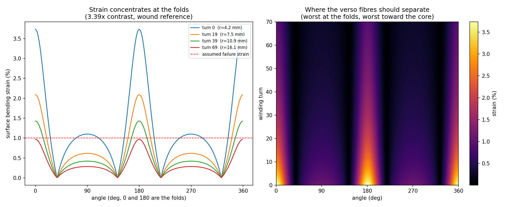

### Which fibres, and why

Papyrus is a two-ply cross laminate: recto fibres run along the roll's
length, verso fibres along its axis. Herculaneum rolls are wound with the
written recto inward, so at a fold the **verso is the convex face** and takes
the tension. That tension acts circumferentially — along the arc. The recto
fibres lie along it and resist it the way fibres are strong, along their own
axis. The verso fibres lie *across* it and carry nothing, so the only thing
that can give is the bond between them: **they separate laterally.** It is a
consequence of the laminate structure, not an assumption.

### The reference state is the wound roll, not a flat sheet

A first pass used absolute curvature and got a fold/flat strain ratio of
exactly (a/b)³ = 8 for a 2:1 crush. That is the ratio for a sheet that is
stress-free when **flat** — true of fresh papyrus being wound for the first
time, false here. These rolls stood wound for decades and then carbonized in
that shape, so the stress-free reference is the **wound** state and what
strains the material is the *change* in curvature:

    ε(θ) = (t/2) · | κ_crushed(θ) − 1/r |

That changes the picture. At the fold the sheet is sharpened (κ: 1/r →
3.084/r); along the flattened sides it is **unbent** (κ: 1/r → 0.386/r) — and
unbending strains the material too. So the flat sides are not unloaded, only
less loaded, and the contrast falls from 8.0× to **3.39×**. `--reference
flat` reproduces the old figure for comparison; `wound` is the default
because it is the defensible one.

### The neutral angle — the result worth having

Between a fold (κ sharpened above 1/r) and a flat side (κ relaxed below it),
the curvature must **pass through 1/r**. At that angle the crush leaves the
sheet exactly as it was wound: unstrained, neither cracked nor unbent.

It sits at **37.64° from the fold axis** — four pristine sectors at 38°,
142°, 218° and 322° — and it is **scale invariant**: a and b both scale with
r, so κ·r depends only on θ and the aspect ratio. The same angle at every
depth, running through the whole roll like spokes.

Which makes it **invertible**, and that is the point:

| crush ratio | neutral angle |
|---|---|
| 1.5 : 1 | 40.7° |
| **2 : 1** | **37.6°** |
| 3 : 1 | 33.5° |
| 4 : 1 | 30.8° |

It looked like it would also make a ruler — *measure where the best-preserved
sectors lie and read off the crush ratio*, with no dependence on pitch,
umbilicus, thickness or grid. **That claim has been tested and withdrawn.**
Run against per-cell labels on PHerc1218, the zones are there and the spokes
are not: the crease axis is severely damaged by void and the flattened axis by
merging — the two-mechanism split, confirmed — but the preserved fraction is a
broad flat band from ~20° to ~70°, and the neutral zone does not beat its own
flanks (z = −0.8 and +1.0). Details, and why the joins cannot account for it,
in [`docs/data_sources.md`](docs/data_sources.md), "The neutral angle: tested
on the labels, and not found".

### A three-zone angular signature

Put together with the layer spacing from section 7, one geometry predicts
three different states at three different angles:

| angle | prediction |
|---|---|
| 0° / 180° (folds) | **cracking** — strain 3.39× the flat sides, growing as 1/r toward the core |
| 38° / 142° / 218° / 322° | **intact** — the crush leaves the sheet unstrained |
| 90° / 270° (flattened axis) | **merging** — layers packed below the nominal winding pitch |

All three are angular, all three are measurable, and none needs a calibration
constant.

### What is derived and what is assumed

Derived, calibration-free: the curvature field, the 3.39× contrast, the 1/r
radial gradient, and the neutral angle. These follow from the measured 2:1
section alone.

Assumed, and dominating only the **absolute** percentages: the sheet
thickness (0.150 mm) and a failure strain for carbonized papyrus, which is
not established — `--failure-strain` is a knob and the tool reports the
threshold crossing for whatever you set. **The map is the result; the
percentages are provisional.**

### Validation

| exam | criterion | result |
|---|---|---|
| A — no crush, no strain | at ratio 1:1 the wound-reference strain must vanish; the flat-reference model must not | **6e-18 vs 1.8e-2, PASS** |
| B — closed form at the vertices | numeric fold and flat values match the analytic ones; ratio = 3.39 (wound) and 8.00 (flat) | **PASS** |
| C — radial gradient | inner/outer strain equals r_out/r_in exactly | **3.8513 vs 3.8513, PASS** |
| D — neutral angle | identical at turn 0 and turn 69, and inverts back to the input crush ratio | **37.64°, ratio 2.00, PASS** |

Exam A exists to catch the error that was actually made: with no crush at
all, a flat-reference model still reports strain. If anyone reinstates the
wrong reference state, it fails. Exam B was also earned — its first version
compared the maximum and minimum over θ, and failed, because the minimum is
the neutral-angle **zero**, not the flattened-axis value. Finding that is how
the neutral angle turned up at all.

---

## 9 — Work size (`scripts/work_size.py`, `archives/results/roll_catalogue.csv`)

How big a roll does a work make, and which work fits a roll? Two directions:

- **forward** — a work of N columns → sheet length → roll diameter → crushed
  section.
- **inverse** — a measured crushed section → implied column count →
  candidates from a catalogue. And the outcome worth having: **a roll whose
  implied size matches nothing known is a candidate for a work that did not
  survive the medieval tradition** — which turns a curiosity into a priority
  list of which sealed roll to unwrap next.

```bash
python scripts/work_size.py identify --section 42 21
python scripts/work_size.py population --section 42 21
python scripts/work_size.py test
python scripts/phase_tracking.py test
```

> **The column period underpinning these counts is now vindicated** on the
> Grand Prize render (see [`docs/data_sources.md`](docs/data_sources.md),
> "Grid self-consistency"), so the 43 mm branch is the working one and the
> counts below are usable. The 72 mm branch stays in the sensitivity output
> because Herculaneum column widths genuinely vary between rolls — it is an
> alternative for *other* scrolls, not a rival reading of this one.

**Prior art, stated first.** Reconstructing a roll's original length and
column count from its geometry is standard papyrology, done on opened rolls
by measuring the width of successive volutions against column beginnings —
the reconstruction of PHerc. 1004 from 30 pieces is a worked example. Nothing
here invents the method. The only new input is CT geometry from a roll that
was never opened, and therefore never disturbed.

### Why columns and not characters

The chain `columns → sheet length → diameter` needs only the **column
period**. Going through characters — or through *stichoi* for prose — also
needs the **letter pitch**, because an ancient stichos is a notional
35-letter unit (the length of a Homeric hexameter), not a physical line. The
letter pitch is the least trustworthy number in the grid (see mode 8 and
`band_sensitivity.py`). So columns are
firm, characters are provisional, and the tool labels which is which. For
**verse** the stichos *is* the physical line, so that route stays clean —
which happens to favour the Latin material, most of which is verse.

### The base rate is the cheapest measurement available

An implied column count inherits three unknowns: the umbilicus, the winding
pitch, and the layout regime. Decomposing the band shows they are not
comparable:

| resolving… | band becomes |
|---|---|
| **the prose column period** (43 or 72 mm) | 80–98 or 47–58 |
| the regime (prose or verse) | 47–98 or 35–43 |
| the umbilicus | 38–95 |
| the winding pitch | 38–98 |

The column period has become the dominant term, and unlike the others it is
not a declared assumption but a **measurement that contradicts itself** — see
the self-consistency check in `docs/data_sources.md`.

And the regime is not a coin flip. Of ~1826 rolls from this library, **62 are
Latin** (Sider 2005), and every identified Latin text is **verse** — the
*Carmen de Bello Actiaco*, Lucretius, Ennius' *Annales*, Caecilius Statius'
*Obolostates*. The Greek remainder is overwhelmingly Epicurean prose. So
P(Greek prose) ≈ 0.966, and for PHerc1218 the prose band is **47–98
columns**, with 35–43 as a low-prior verse alternative. The prose band is wide
because the column period inside it is contested: 80–98 at 43 mm, 47–58 at
72 mm.

That reduction cost no scan. It is a base rate, and it removes more
uncertainty than the umbilicus and the pitch put together.

### A population check that is worth more than the band

The measured 42 × 21 mm section gives an equal-perimeter diameter of
**3.24 cm**. Intact Herculaneum rolls run **4–6 cm** in diameter and 19–24 cm
in height. PHerc1218 is therefore ~19 % below the population floor, which
admits two readings, and they are distinguishable:

- it was a small roll; or
- **what survives is not what was buried.** The precedent is exact: PHerc.
  1667 was reduced from 4.9 cm to 2 cm of diameter by 19th- and 20th-century
  opening attempts, losing more than half its content.

A stripped roll should show a truncated *outer* surface; an intrinsically
small one should not. If layers are missing, every size estimated from the
present section is a **lower bound**.

### The catalogue, and the rule that keeps it honest

`archives/results/roll_catalogue.csv` carries one row per roll or work, in columns where
possible, and **every sized row must name its source**. Exam C fails on any
number without one, so the catalogue cannot degrade quietly as it grows. An
empty cell is information; an invented one is damage.

Sizes come from Gigante's *Catalogo dei Papiri Ercolanesi* and Sider's
*Library of the Villa dei Papiri*, one sourced row at a time. Anchors in place: Philodemus' *On Piety* at ~367 columns and *On Poems* II at
**222 columns in a 16 m roll of 100 kollemata** — both far larger than
PHerc1218 and correctly excluded. PHerc. 1667 gives ~20 columns over ~1.5 m
of surviving roll, and PHerc. 172 (*On Vices* I) more than 70. PHerc. 118
carries no size but supplies the **17 characters per line** that the grid
self-consistency check turns on.

### Validation

| exam | criterion | result |
|---|---|---|
| A — round trip | forward(N) → section → inverse returns N, for N = 20…200 | **exact, PASS** |
| B — the band must stay wide | the raw implied band spans > 2× while the umbilicus is unmeasured | **2.8×, PASS** |
| C — no unsourced sizes | every row carrying a column or stichoi count names a source | **PASS** |

Exam B is written backwards on purpose: it **fails if the band narrows**
without anyone having measured the umbilicus. It is a guard against a future
version of this tool quoting a confident single figure, which is the failure
mode most likely to produce a wrong attribution.

---

## 11 — Unroll and diagnose (`scripts/displacement_field.py`)

> **The flattening is the vehicle. The map of where to trust it is the result.**

One argument in three steps, and it only stands as one. The crush displaced every
point of papyrus; that field is measurable from geometry alone. Invert it and the
sheet lies flat. Project the per-ray diagnostics onto that flat sheet and you get
the thing a reader of this repository can actually use: **a map of where the
recovered geometry is trustworthy and where it is not**, in sheet coordinates
rather than roll coordinates.

Nothing in the chain uses ink, renders, labels or a fitted model of the crush. The
only physical premise is that **papyrus bends and crushes but does not stretch** —
arc length along a winding is conserved.

```bash
python scripts/displacement_field.py field  --from-csv rays.csv.gz
python scripts/displacement_field.py rings  --from-csv rays.csv.gz --plot rings3d.png
python scripts/displacement_field.py sheet  --from-csv rays.csv.gz --plot sheet.png
python scripts/displacement_field.py test
```

### 11.1 — The displacement field: where the crush put every point

Where the crush put each point of papyrus, measured rather than modelled.
Mark points along the axial striations of the wound cylinder, crush it, and ask
where each one ended up — because the answer is what an unwrapping has to
invert.

The sheet is inextensible, so arc length along a turn is conserved and a
point's position on the **sheet** is recoverable from the crushed shape alone:
measure the boundary r(θ) of a turn, integrate arc length around it, and a
point's arc fraction is where it sat on the cylinder. The displacement is the
difference from its polar angle in the crushed frame. No model of the crush is
required — only the measured shape, which a per-ray crossing table provides.

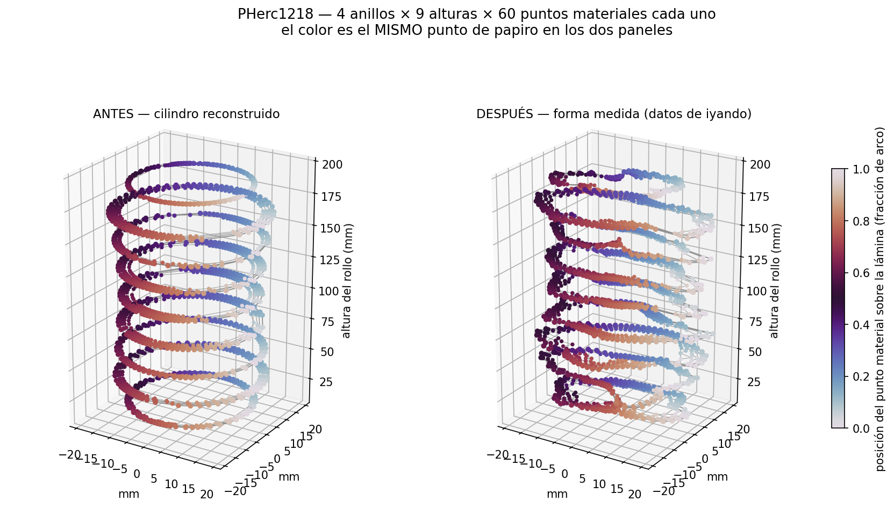

*Four rings, nine heights, sixty material points each. Colour is the same
papyrus in both panels. The "before" is not a model — it is the cylinder
reconstructed from the measured shape by arc length.*

### Measured on PHerc1218

Over the public per-ray crossings (1.39 M, z 1000–11000 on the L1 grid):

| ring | radius | max displacement | correlation with outer ring | transfer residual |
|---|---|---|---|---|
| 0 | 13.8 mm | 16.5° | 1.000 | — |
| 16 | 10.5 mm | 18.2° | 0.991 | 0.25 mm |
| 25 | 8.9 mm | 19.0° | 0.984 | 0.28 mm |
| 45 | 5.7 mm | 19.4° | 0.959 | 0.30 mm |

**The twin's depth-invariance prediction holds.** An arc-length-preserving
crush onto sections that scale with r gives a displacement depending only on
arc fraction and shape — identical at every depth. Measured: r ≥ 0.959 across a
factor 2.4 in radius, and r = +0.956 between the lower and upper halves of the
scroll. That was a prediction before it was a measurement.

**The amplitude is 40 % higher than the ellipse allows.** The 2.08:1 ellipse
predicts 12.3° at 54° from the crease axis; the measurement gives 16.5–19.4°
with maxima at 324° and 138–144°. Fitting the **median** boundary gives a = 21.36, b = 10.27 mm, ratio 2.08,
R² = 0.948 — but see the correction below: that fit is to an average shape and
individual sections are markedly less elliptical. The excess remains
unexplained.

**That ratio was over-stated here and is now corrected.** An earlier version
read the 2.08 as a constant measured off the boundary, and used it to settle
the span-versus-pitch disagreement of Mode 8 in favour of the span. Two things
were wrong with that. The fit was to the **median** profile over 313 heights,
and averaging irregular sections manufactures an ellipse that exists at no
height: fitted individually, real sections give R² **0.848** (range
0.592–0.934) against the median's 0.948. And the ratio is not one number but a
wide distribution — **1.35 to 3.16, median 2.01**, with the major axis rotating
through the roll (standard deviation 85°) rather than holding a fixed
orientation. The span still looks closer than the pitch, but on a median of a
broad distribution, not on a constant.

### What it is for, and the claim that was withdrawn

**For:** deducing what deformation each point underwent, so it can be put back.
The field transfers inward — applying the outer ring's profile to inner rings
leaves 0.20–0.33 mm of arc against a 4.0 mm amplitude. That matters because the
outer turns are where segmentation is reliable and the inner turns are where the
unread text sits.

**Withdrawn:** an earlier version argued that unwrapping pipelines map by polar
angle and therefore misplace text by two or three letters, and offered this as
the fix. Paul (ScrollPrize) replied that their renders are flattened by
minimising symmetric Dirichlet energy and do not map by polar angle. The failure
mode the argument rested on does not exist there, and minimising distortion over
the whole surface is a better solution than an arc-length lookup anyway. **What
fell was that claim, not the use above.**

### What else the rings say

- **No longitudinal compression.** Had the roll shortened, material would bulge
  outward where compressed and the section perimeter would track height. It does
  not: median 117.0 mm, correlation with height r = +0.143.
- **But the crush is not uniform along the roll.** Isoperimetric circularity of
  the outer ring runs 0.563 at 125–150 mm of height against 0.806 at 175–200.
  Markedly flatter in the middle than at the ends. (The absolute ratio implied by
  circularity is biased high by boundary roughness — read the variation, not the
  value.)
- **Fewer resolved windings in the middle, and it is not lost material.**
  Median crossings per ray fall to 56 at 125–150 mm of height against 70 at
  both ends. An earlier version of this section read that as erosion, in the
  opposite direction and from a badly pooled count. The control settles it: if
  outer turns were gone the slice perimeter would fall with them, and it does
  not — perimeter against crossing count gives r = +0.084, and at 125–150 mm
  the perimeter is a normal 115.1 mm. The outer boundary is where it should be;
  the missing crossings are interior layers the segmentation cannot separate.
  (A raw correlation of crossing count against *outer radius* does read +0.31,
  but that is the flattened shape: a ray leaving along the short axis has both
  a small outer radius and less radial distance to cross. Perimeter is the
  angle-independent control and it is flat.)

  Note also what this indexing cannot see. Ring 0 is defined as the outermost
  surviving crossing, so if outer turns were lost the index simply shifts and
  the loss is invisible. Testing for outer erosion would need a model of the
  intact roll to compare against, which is exactly what is missing.

### Feeding it back into the twin

`synthetic_scroll_twin.py --section-profile` now takes a **measured** section in
place of the analytic ellipse, rescaled per turn so the perimeter still equals
the wound circumference. The shipped profile
(`archives/results/pherc1218_section.csv`, 60 angles, median over 313 L1 slices) moves
the twin's crushed section from 41.9 × 21.0 mm to 44.4 × 21.2 mm.

This is the order that was wrong before and is right now: **the data set the
shape, the model came after.** Keeping the ellipse once a measured profile
exists would be modelling first.

### Validation

| exam | criterion | result |
|---|---|---|
| A — arc integration | chord-based arc fraction within 0.002 of a turn of the exact elliptic value | **2.1e-4 (0.077°), PASS** |
| B — depth invariance | nested synthetic sections agree to < 0.01° | **1.6e-13°, PASS** |
| C — amplitude scales | monotone in aspect ratio, and < 0.2° on a circular section | **1.4 → 26.5°, 0.014°, PASS** |
| D — transfer | residual under a third of the target amplitude on a deliberate 2.08→2.6 mismatch | **3 %, PASS** |

Exam A was rewritten because its first version failed at 2.75° and the failure
was the exam's: it compared the displacement profile against the closed form
pointwise, but the two are inverse functions — arc fraction to polar angle
against polar angle to arc fraction — so the same numeric grid indexes different
material points. Exam C's second half exists so the method cannot pass by
measuring its own discretisation: on an uncrushed section it must report
nothing, and it reports 0.014°.

---

### 11.2 — Inverting it: the sheet laid flat

Mode 11 reconstructs the outer resolved part of PHerc1218 as a flat material sheet using only the published per-ray crossing positions. It uses no ink signal, no rendered surface, no OCR, and no fitted model of the crush.

The physical premise is deliberately small:

> **Papyrus may bend and crush, but arc length along each winding is approximately conserved.**

If the boundary of a winding can be measured in the crushed section, its material coordinate can be recovered by integrating distance along that boundary. Each transverse section can then be cut at a common radial reference, straightened into a segment, and stacked with its neighbours.

This does not yet read the scroll. It establishes a geometry on which later measurements — including ink, CT intensity, confidence, fibre direction or thickness — may be registered.

### What enters the reconstruction

The input is the per-ray crossing geometry published by [@iyando](https://github.com/iyando): ordered radial crossing positions for successive angular rays and transverse sections of PHerc1218.

For each resolved winding and section, Mode 11:

1. reconstructs the measured closed boundary \(r(\theta)\);
2. evaluates its perimeter by numerical arc-length integration;
3. assigns every sampled point a normalized material coordinate

\[
u(\theta)=
\frac{
\displaystyle\int_{\theta_0}^{\theta}
\sqrt{r(\varphi)^2+\left(\frac{dr}{d\varphi}\right)^2}\,d\varphi
}{
\displaystyle\oint
\sqrt{r(\varphi)^2+\left(\frac{dr}{d\varphi}\right)^2}\,d\varphi
};
\]

4. cuts all windings at the same radial reference \(\theta_0\);
5. maps \(u\in[0,1]\) to physical arc length along the flattened winding;
6. stacks the reconstructed transverse sections along the scroll axis.

No analytic ellipse is required. The measured PHerc1218 section profile therefore replaces the idealized crushed section used by the synthetic twin in Mode 7.


*Figure 11-1 — The same material points before and after the crush. Left: the cylinder reconstructed from the measured shape by arc length. Right: the measured crushed section. Colour identifies corresponding material points, not ink. The flattened sheet itself is Figure 11-3 below; the trust map is Figure 11-4.*

### Which way it reads

The reconstruction has an orientation, and it is not arbitrary.

**Ring 0 — the outermost winding — is the first column.** A book roll is
stored with the start of the text on the outside: the reader holds it in the
right hand, draws the free end leftwards, and winds the read portion onto the
left. The core is therefore the *end* of the work — which is why Herculaneum
end-titles survive, protected at the centre, and why loss of outer windings
costs the **opening** of a text rather than its close.

**The ink is on the inward-facing side, and is never exposed.** Papyrus is
written on the recto, the face with horizontal fibres, and the roll is wound
recto-inward. The text faces the core; the blank verso takes the outside. This
is the same recto-inward assumption the fibre-strain argument of Mode 8 rests
on, and it answers the obvious objection — writing on an exposed surface would
have destroyed the text before it could be read.

**One caveat on the horizontal axis.** The winding *sense* is not firmly
established for PHerc1218: it was set from a single multi-turn instance, and
the spiral constraints are mirror-symmetric, so a wrong sense mirrors the arc
axis. Until that is closed, a registered text could come out reversed. The
fix is at render time and costs nothing, but it has to be checked rather than
assumed.

This is what the flattening is for. The sheet is a **coordinate system**: once
each material point has a place, any per-point quantity can be registered onto
it — ink probability above all, but equally CT intensity, confidence, fibre
direction or local thickness. Whether the result reads is then a question the
geometry has made askable.

### Reconstructed extent

The current reconstruction covers the outer resolved portion of the scroll:

| quantity | reconstructed value |
|---|---:|
| resolved radial fraction | outer \(\sim 60\%\) |
| innermost resolved radius | 9.73 mm |
| crossing indices represented | 46 |
| transverse sections | 313 |
| samples per winding and section | 120 |
| measured cells | 92% |
| summed measured perimeter | 3.99 m |
| reconstructed sheet height | 173 mm |
| outer resolved winding length | 113.8 mm |
| inner resolved winding length | 61.1 mm |

Coverage is complete over the first metre of sheet length, remains approximately 94% to 2.9 m, and is still about 80% over the final resolved stretch. The decline beyond that point is treated as a segmentation limit, not as evidence of material loss.

---

### What the geometry measures

#### 1. The reconstruction passes an internal spiral-consistency test

For each measured winding perimeter \(L_i\), define the radius of a circle with the same perimeter:

\[
r_i=\frac{L_i}{2\pi}.
\]

For an Archimedean spiral of constant pitch \(p\), successive physical windings satisfy

\[
r_i=r_0-ip,
\]

and therefore

\[
L_i=L_0-2\pi p\,i.
\]

The equivalent radius must decrease linearly with physical winding number. That relation is not imposed by the flattening procedure: it is an independent consequence of a consistently indexed, approximately inextensible wound sheet.

Over the first forty resolved windings, the measured equivalent radii follow the expected linear relation with

\[
R^2=0.9998.
\]

The fit degrades after winding 45, reaching approximately \(R^2=0.94\) by winding 55 and \(R^2=0.83\) by winding 60. Because the outer range is exceptionally linear while the deterioration coincides with poorer crossing resolution, the conservative interpretation is that the degradation belongs to the segmentation rather than to a sudden change in papyrus pitch.

This test validates one property only: the recovered sequence is geometrically consistent with successive windings of a spiral over the well-resolved range. It does **not** prove that every individual correspondence or crossing label is correct.

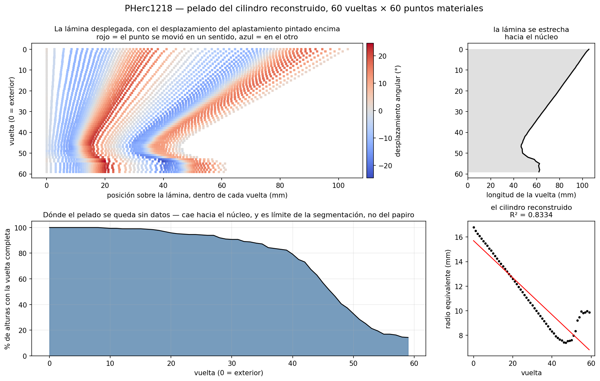

*Figure 11-2 — Four views of the peel. Top left: the flat sheet with the
crush displacement painted on it. Top right: winding length shrinking toward
the core. Bottom right: the reconstructed cylinder, the spiral-consistency
test.*

*Read the bottom-left panel with care.* It shows the fraction of heights at
which each crossing index is complete, and that curve **must** fall with index
whatever the papyrus did: the n-th crossing only exists on rays carrying at
least n+1 crossings. It is a property of the indexing, not a map of material
loss — see "A result that did not survive testing" below, where the
angle-independent control settles the question.

#### 2. Crossing indices are not identical to physical windings

The crossing list contains 46 resolved indices over a radial interval that corresponds, at the corroborated mean pitch of 173 µm, to approximately 48.5 physical windings.

Thus

\[
\frac{48.5}{46}=1.054,
\]

or about **1.054 physical windings per resolved crossing index**.

Equivalently, approximately

\[
1-\frac{46}{48.5}=5.2\%
\]

of the physical windings in this interval are not represented as separate crossing indices. They are most naturally interpreted as neighbouring turns merged by the segmentation.

The sheet length provides a second estimate of the same loss:

- sum of individually measured perimeters: **3.99 m**;
- spiral integral over the same radial interval: **4.24 m**;
- missing length: **0.25 m**.

The difference is 5.9% of the spiral-integrated total, or 6.3% when expressed relative to the measured 3.99 m. These percentages are not numerically identical to the 5.2% unresolved-turn fraction because perimeter changes with radius and the comparison has finite-range boundary effects. They are nevertheless of the same magnitude and point in the same direction.

The important closure is therefore not an artificial equality of rounded percentages. It is that two independent calculations — radial winding count and integrated sheet length — both require a small population of unresolved turns.

> **Geometry closes within the expected effect of merged windings.**  
> 46 crossing indices represent about 48.5 physical turns; the directly measured sheet is correspondingly shorter than the spiral integral.

#### 3. The crush displacement field is nearly depth-invariant

Once each boundary point has both an angular coordinate in the crushed section and a material arc coordinate on the reconstructed sheet, the crush can be expressed as an angular displacement field.

Across a factor of approximately 2.4 in radius, displacement profiles correlate at

\[
r\geq 0.959.
\]

The lower and upper halves of the sampled scroll height correlate at

\[
r=0.956.
\]

The remaining arc-length residual is approximately 0.20–0.33 mm against a displacement amplitude of about 4.0 mm.

The conclusion is practical: the same crush pattern appears throughout the resolved depth of the scroll. The outer windings, where segmentation is clearer, can therefore act as a calibration region for deeper windings, where individual crossings become ambiguous.

This is not a claim that every inner winding can already be recovered. It is evidence that a correction field measured outside may transfer inward without requiring an independent deformation model at every depth.

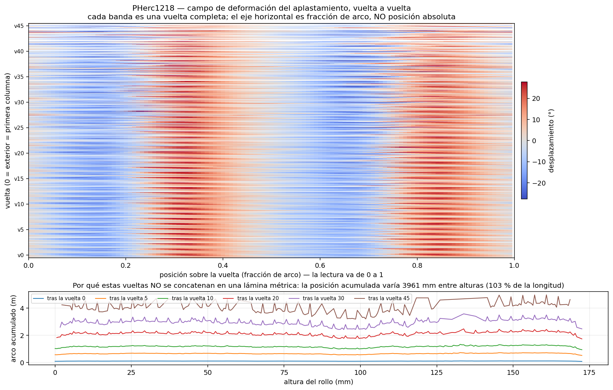

*Figure 11-3 — Angular displacement expressed in material coordinates across winding depth and scroll height. The persistence of the same pattern is the relevant result; the colour scale should remain fixed across all panels.*

---

### A result that did not survive testing

An earlier interpretation treated the declining completeness of high crossing indices as evidence that material loss increased towards the core.

That inference was wrong.

The \(n\)-th crossing can only exist on rays containing at least \(n+1\) crossings. A completeness curve indexed from the outside must therefore fall even for a perfectly preserved roll. The indexing also makes outer loss invisible by construction, because crossing 0 is defined as the outermost surviving crossing on each ray.

An angle-independent control resolves the ambiguity. If outer windings were systematically missing, the measured slice perimeter should decrease with crossing count. It does not:

\[
r=+0.084.
\]

A raw correlation between crossing count and outer radius gives approximately \(r=+0.31\), but that follows from the flattened shape of the section and is not evidence of erosion.

Mode 11 therefore makes **no claim of outer material loss** from crossing completeness. The missing crossing indices identified above are interior unresolved or merged turns.

Keeping this retraction in the record is part of the method: an acceptance test is useful only when it is allowed to overturn the story that motivated it.

---

### The measured section is not an ellipse

The measured PHerc1218 section is close to elliptical, but not fully described by an ellipse:

\[
R^2_{\mathrm{ellipse}}=0.948.
\]

More importantly, the measured displacement amplitude is approximately 40% greater than predicted by an equal-perimeter ellipse with the observed aspect ratio, and its maxima are shifted away from the ellipse symmetry points.

The approximately 2% difference between the two hemispheres is too small to explain that excess.

Possible causes include localized plastic deformation, inter-layer slip, adhesion, core constraints or nonuniform relaxation, but the present geometry does not distinguish among them. The excess displacement remains unresolved.

For that reason, Mode 11 uses the measured section profile directly. The ellipse remains useful as a controlled analytic reference in the synthetic twin, but it is no longer treated as a complete description of the real crush.

---

### Acceptance tests

The mode should be considered usable only while the following tests continue to pass on regenerated data.

| exam | criterion | current result |
|---|---|---:|
| A — arc-length bookkeeping | every flattened winding length equals its numerically integrated measured perimeter within numerical tolerance | **PASS** |
| B — spiral consistency | equivalent radius linearity over the first 40 resolved windings, \(R^2>0.995\) | **0.9998, PASS** |
| C — independent count closure | pitch-based physical turn count exceeds resolved crossing count by the same order required by the length deficit | **48.5 vs 46, PASS** |
| D — depth transfer | displacement-profile correlation remains \(r>0.95\) across the tested radial range | **\(\geq0.959\), PASS** |
| E — height transfer | lower-versus-upper displacement correlation remains \(r>0.95\) | **0.956, PASS** |
| F — degradation is declared | the pipeline must report the winding range after which spiral linearity deteriorates rather than silently extrapolating through it | **after \(\sim45\), PASS** |

The exact numerical tolerances should live in the script rather than only in this README section, so that future changes can fail automatically.

---

### Declared limits

1. **Only the outer resolved \(\sim60\%\) of the radius is reconstructed.** Windings inside 9.73 mm are not resolved and are not inferred here.
2. **The method assumes approximate inextensibility along each winding.** Local tearing, slip or plastic extension can violate that assumption.
3. **Crossing identity remains an input dependency.** Spiral linearity is a strong consistency test, not proof that every crossing is correctly labelled.
4. **The mean pitch is used only as a radial accounting scale.** Local wrap-to-wrap pitch measurements remain too unstable to support pointwise predictions.
5. **No ink is detected.** The output is a material-coordinate surface, not a readable text render.
6. **The inner degradation is not filled by interpolation.** Transferability of the outer displacement field is measured, but reconstruction beyond the resolved range remains future work.
7. **The real crush is not elliptical.** Analytic ellipse results are references, not substitutes for the measured section.
8. **The source measurements remain attributable to their publisher.** This reconstruction is an arc-length integration over the published per-ray crossings, not an independent re-segmentation of the CT volume.

---

### Material coordinates: the reusable output

The principal output of Mode 11 is not a PNG. It is a material coordinate system.

Each reconstructed point can be stored as, for example,

```text
(section_z, winding_id, arc_fraction, arc_length_mm, x_flat_mm, y_flat_mm)
```

with provenance and confidence fields attached to the crossing from which it was derived.

That coordinate system is independent of imaging modality. Once established, any scalar or vector quantity sampled from the original volume may be associated with the same material point:

```text
ink probability
raw CT attenuation
surface confidence
crossing confidence
fibre orientation
surface normal
local thickness
damage class
multispectral response
segmentation provenance
```

The relationship is analogous to texture coordinates on a three-dimensional mesh: geometry defines the support first; measurements are then projected onto it.

This separation matters because future ink models need not solve the geometry again. They need only estimate a quantity in the source volume and transfer it to the existing material coordinates.

---

#### The displacement law, read through the full ring stack

**The transfer law holds through the roll, not just at the surface.** Reading
all rings of the published crossing table (0–38, step 2, medians over 313
heights), every winding follows the same displacement curve: correlation with
the outer ring runs 1.000 → 0.952 with no break, and the median residual grows
smoothly from 0.5° to 3.7° — sub-millimetre of arc throughout. Together with
the analytic match of the outer ring (+0.936 against the equal-perimeter
ellipse), this makes the crush a parallel, flexural-slip fold in the
structural-geology sense: one law, every winding. Practical consequence: given
the local aspect ratio, the law predicts point positions on any winding to
~1–2°, so the unrolling gains an interpolation term where segmentation drops
windings. Medians over height smooth the per-height figure; the per-height
residual will be somewhat larger.

---

### Future extensions

The following extensions are direct consequences of the present representation rather than claims of completed work.

#### Project CT or ink probability onto the sheet

If the source scan provides an intensity or ink-probability value \(I(x,y,z)\), each reconstructed material point can sample that field before flattening:

\[
I_{\mathrm{flat}}(u,z)=I\!\left(x(u,z),y(u,z),z\right).
\]

The flattening algorithm does not change. Geometry and reading remain separate stages.

A binary ink/empty label is possible, but retaining the continuous probability or attenuation value is preferable: thresholding can then be revised without recomputing the geometry.

#### Carry uncertainty into the flattened image

Every point should retain:

- crossing-position uncertainty;
- winding-identity confidence;
- local interpolation distance;
- spiral-fit residual;
- displacement-transfer residual;
- source-voxel support.

A flattened intensity map without its confidence map would look more certain than the underlying geometry warrants.

#### Transfer the measured displacement field inward

The observed depth invariance suggests a constrained inner reconstruction in which the outer field supplies a prior, while inner crossings and CT evidence determine local corrections.

The acceptance condition must remain strict: transfer is allowed only while held-out resolved windings are predicted within the measured 0.20–0.33 mm arc residual.

#### Replace the analytic crush in the synthetic twin

Mode 7 currently uses a controlled analytic section because it provides exact ground truth. Mode 11 adds the complementary object: a measured section profile.

Both should remain:

- the analytic ellipse for closed-form tests and known truth;
- the measured PHerc1218 profile for realistic deformation and segmentation stress tests.

The twin becomes more realistic without pretending that the measured profile supplies perfect labels.

#### Multi-modal registration

Because all measurements share the same material coordinates, geometry, ink probability, fibres, thickness and damage can be compared point by point on one flattened domain.

That creates a common reference frame for methods that currently operate on different representations of the scroll.

---

### Role within the repository

Modes 1–5 ask whether the scribe's spatial grid survives on a rendered surface. Mode 6 evaluates whether the crossing count is geometrically plausible. Modes 7–9 use an idealized scroll to make predictions about winding, strain and work size.

Mode 11 links those two halves.

It reconstructs a material sheet from measured real-scroll geometry, tests whether the winding sequence behaves like a spiral, quantifies unresolved turns, measures the crush displacement, and exposes the point at which segmentation stops supporting the reconstruction.

It therefore establishes the substrate on which the earlier text-grid tools may later operate:

\[
\text{measured crossings}
\rightarrow
\text{material coordinates}
\rightarrow
\text{registered CT / ink}
\rightarrow
\text{grid-based validation}.
\]

**Measure the geometry first; read the text later.**

---

### Credit and provenance

The reconstruction depends on @iyando's publication of per-ray crossing positions rather than only per-scroll aggregates. The flattened sheet, perimeter sums, spiral test and displacement field are derived from those measurements by arc-length integration.

The raw crossing source, preprocessing steps, commit identifier and any filtered subsets used to regenerate the figures should be recorded in `docs/data_sources.md`. Quantitative claims in this section should be regenerated from the scripts and not copied manually into release notes.

---


### 11.3 — Where to trust it: diagnostics in sheet coordinates

The flat sheet is a coordinate system, so any per-point quantity registers onto it.
Ink is the one everybody wants and PHerc1218 does not have. What it does have is the
per-ray quality table, and projecting that answers a question worth asking **before**
anyone spends compute here: which parts of this sheet are worth the compute at all.

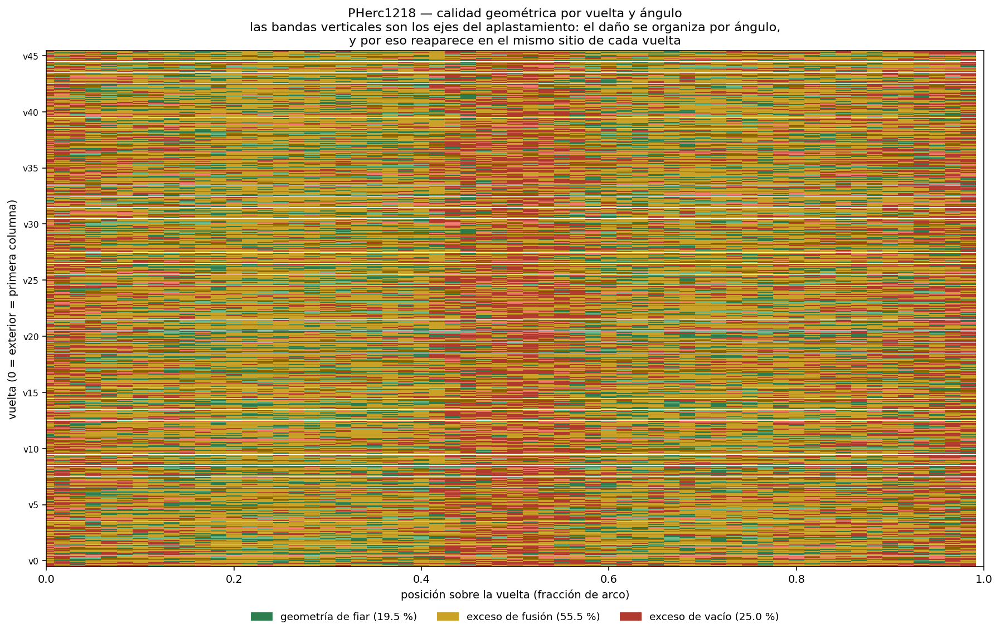

*Figure 11-4 — Geometric trust by winding and angle. With the windings shown
side by side rather than concatenated, the vertical banding lines up across
them: the damage is organised by the crush axes, so it recurs at the same place
in every winding.*

| | fraction of the sheet |
|---|---|
| clean geometry | **19.5 %** |
| merge excess — layers stuck together | 73.6 % |
| void excess — cracked | 25.0 % |

**One fifth of the reconstructed sheet has clean geometry.** That is the headline,
and it is not a prediction about legibility: it says that four fifths of it carries a
*known geometric problem* before an ink model is even loaded.

The angular structure of Mode 8 survives the projection. Void concentrates at
135–225° and 315–360° — the crease axis, where bending strain is 3.4× and carbonized
papyrus cracks — while the flattened axis fails by merging instead. On the rolled
scroll that is an angular pattern; on the flat sheet it becomes **periodic banding
with the period of one winding**, which is directly actionable: it says which part of
each column is compromised, not just which region of the scroll.

Two honest limits on this map. The void threshold is the **upper quartile**, a
descriptive cut rather than a physical one — it partitions 25 % by construction, so
read the three-way split and not the 25 %. And the angular resolution is the source
data's 6°, which is 1.57 mm of arc on the outer windings against a letter pitch near
1.8 mm: **under one sample per letter.** This map tells you where to look. It cannot
tell you what letter is there, and no interpolation would change that — the
information between rays is not smoothed, it is absent.

Reading a scroll from this geometry would need an extraction at reading resolution,
roughly 500 rays per slice rather than 60. That is the same tool with a different
angular step, not a new method.

---

## 11B — Checked against the raw scan, and what did not survive

Everything above is built on published per-ray crossing positions, which are
themselves derived from surface predictions. This section goes to the **raw CT
volume** — the masked scan (8.64 µm native, read at pyramid level 1 =
17.28 µm) directly from the open bucket — and asks
whether the reconstruction lands on papyrus. Some of it does. Some of what was
claimed earlier does not, and that is recorded here rather than quietly fixed.

### What holds

**The reconstructed section matches the scan, per height.**

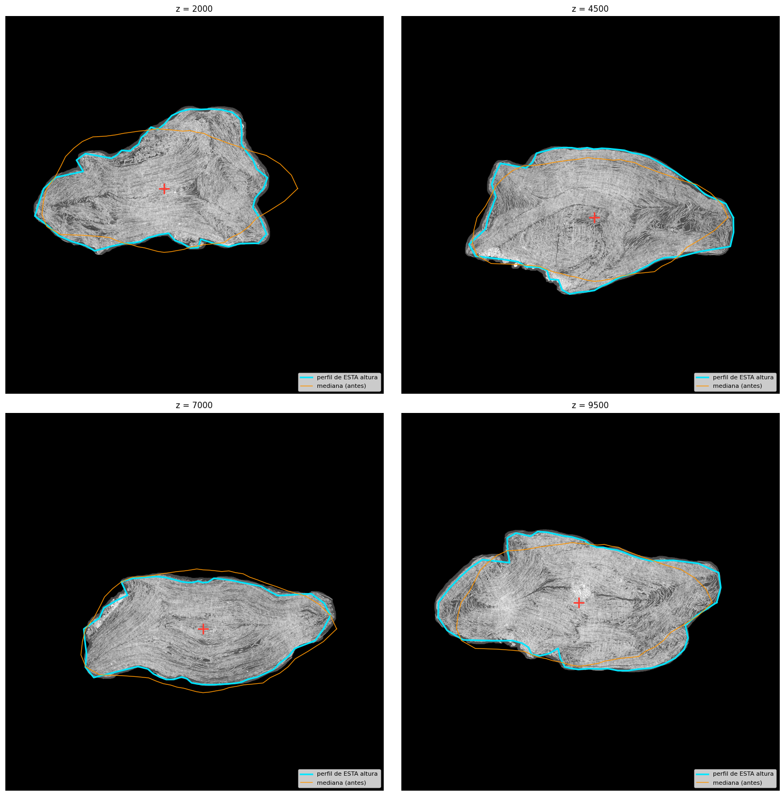

*Figure 11B-1 — The reconstructed cross-section (cyan) drawn on four raw CT
slices of PHerc1218, one per height, with each slice carrying its own measured
profile. The orange curve on the same axes is the single median profile the
earlier version used, shown for contrast. Nothing here is fitted to the CT: the
profiles come from published crossing positions and the scan is read
independently.*

Overlaying the measured profile of a given height on the CT slice at that
height:

| height (L1) | error against CT | correlation |
|---|---|---|
| 2000 | 0.76 mm | **+0.993** |
| 4500 | 0.66 mm | **+0.990** |
| 7000 | 0.71 mm | **+0.993** |
| 9500 | 0.83 mm | **+0.992** |

Under 0.85 mm on a roll of 10–24 mm radius, and the reference angle agrees
without being fitted — the crossing data and a centre-of-mass on raw CT arrive
at the same orientation independently.

**The inter-layer spacing is anisotropic in the raw scan too.** Spectrally, the
period between laminae reads 235 µm on the crease axis against 203 µm on the
flattened axis, with the signal ~2.8× above the local noise floor. Mode 8's
angular prediction survives contact with the scanner, not just with derived
products.

### Three corrections

**The shape correlation quoted earlier was the best of four.** The post that
introduced this work cited 0.98; the other three heights were 0.97, 0.93 and
**0.81**. All four were penalised by comparing each slice against a *median*
profile. Per height they are 0.99 across the board — a better number reached by
a more honest method, and the earlier figure should not have been quoted
singly.

**The flat sheet of 11.2 is sheared, and the shear is mine.** The displacement
within each winding was computed per height, but the **cuts between windings**
used a median perimeter applied to every height. Measured properly, the
cumulative arc position after 46 windings varies by **1779 mm between heights —
44 % of the sheet length**, growing from 5.5 mm of spread after one winding to
412 mm after forty-five. A 150 mm column would drift ~180 mm horizontally top
to bottom, four column widths. The code now accumulates per height; the figure
is a map of deformation and coverage, **not of metric position**.

**Averaging manufactured an ellipse.** The R² = 0.948 elliptical fit cited
throughout is to the median of 313 sections. Fitted individually those sections
give 0.848 (down to 0.592), with the aspect ratio spanning 1.35–3.16 and the
major axis rotating through the roll. The twin's single symmetric section is
more regular than any real slice.

### What could not be fixed, and why

**The residual accumulation is not ours to remove.** Even accumulating per
height, each winding's perimeter varies ~9.8 % between heights — and a winding
of papyrus cannot change length by 9 % over a few millimetres of height. Most
of that is the segmentation losing or merging windings differently at different
heights, and summing over 46 windings amplifies it. Removing it means following
each winding as a continuous object through z rather than slice by slice, which
is surface tracking and belongs to the project's own pipeline.

**Layer-by-layer overlay on raw CT does not work here.** Three detectors were
tried against the raw scan — peak counting, spectral-strength gating, spacing
gating — and the best found **13 %** of the laminae present, with a median
spacing of 430 µm against the 173 µm pitch: two out of three windings skipped.
For comparison, the crossing data underlying everything above carries ~70 per
ray. Tracing laminae on raw CT is what the segmentation pipeline does with
trained models; it is not a scripting exercise and this repository does not
attempt it.

**And there is no simple ink statistic.** On Paris 4's published surface volume,
paired within the same windows, seven per-column statistics were tested against
the published ink labels — mean, spread, max, min, range, through-thickness
gradient, recto/verso asymmetry — resolved both pooled and plane by plane
across the 109 depth planes. **All below d = 0.2**, the best being −0.127 at the
mid-plane with a between-window sign coherence of only −0.33. Density separates
worst of all, at −0.049, which is the expected result and confirms the test was
sound. This is a null with a boundary: it rules out **per-column** statistics,
not the spatial texture between neighbouring columns, which is what a trained
model reads and which no single-point summary can express.

---

## 12 — Contrast phantom (`scripts/contrast_phantom.py`)

A measurement on the published surface model says the sheet it misses is the
**faint** sheet: missed voxels run 10.3 % darker than found voxels inside the
same volume, across 161 of 201 paired volumes, while local thickness and
component size show no difference at all. That measurement cannot say why.
In real papyrus brightness and compression travel together, so two
incompatible readings fit it equally well — *the model cannot learn faint
sheet*, or *faint regions are geometrically harder and darkness is the
symptom*. No measurement on real data separates them, because no real scroll
offers the same geometry at two contrasts.

A phantom does. This mode emits a grid over two axes that are confounded in
reality and independent here:

```bash
python scripts/contrast_phantom.py grid --out phantoms/
python scripts/contrast_phantom.py grid --arm physical    --out p/
python scripts/contrast_phantom.py grid --arm attribution --out a/
python scripts/contrast_phantom.py grid --arm physical --no-kollesis --out control/
python scripts/contrast_phantom.py test
```

The grid ships in **two arms**, because staying faithful to the physics and
isolating one variable are different goals. `--arm physical` holds the sheet
at its real 150 µm, so the gap closes as the pitch drops — which is what a
crushed scroll actually does (measured pitch ~147 µm against ~150 µm sheets on
PHerc1218's flattened axis). `--arm attribution` holds the gap at a fixed 42 %
of the pitch so a failure can be attributed to tightness alone, at the
declared price of a sheet that thins with pitch, which papyrus does not do.
`--no-kollesis` omits the double-thickness joins; single-sheet **control**
cells need it, because with joins on ~9 % of sites carry own-turn material at
~150 µm — inside a 360 µm reader span.

Geometry is bit-identical along a contrast row; intensity statistics are
identical down a geometry column. Every cell carries **per-voxel ground truth**
derived from the same geometry that painted the volume, so there is no
annotation step to be wrong. Each `.npz` also carries exact instance ground truth: `turn_id` (int16, 0 = air,
turn t → t+1) and `kollesis_mask` (bool, the footprint of the double-thickness
sheet joins) — both 2-D (ny, nx) and z-invariant by construction, so broadcast
over z if a reader wants three dimensions. The first feeds fusion readouts; the
second lets a join detector be validated against known joins, which no real
scroll can provide. Run a surface model over the grid and the
confound resolves by inspection:

| recall falls… | reading |
|---|---|
| along the contrast axis only | the model cannot learn faint sheet |
| along the geometry axis only | faint regions are geometrically harder |
| **only in the corner** | the two interact, and neither alone explains it |

The third outcome is the interesting one and it is **invisible in real data**.

**Why the geometry axis is the winding pitch and not the crush ratio** — the
obvious choice, and the wrong one. Under an arc-length-preserving crush the
ratio does not tighten the packing, it *redistributes* it: layers pack closer
on the flattened axis and further apart at the creases, by the same factor. A
ratio sweep makes some angles harder and others easier at once, so a
detector's failure could not be attributed to it. Pitch tightens everywhere,
monotonically. This was found by exam B failing: it measured the layer gap
along a mid-height row, which leaves through the crease axis, and the gaps
*grew* with ratio instead of shrinking.

**Why both axes, when the request was for contrast at fixed geometry.** A
contrast sweep alone shows that faintness hurts, which was never in doubt.
Separating the two readings needs the geometry arm as its control — otherwise
a fall along the contrast axis is still compatible with "the hard cases were
dark anyway", because one row cannot say what geometry costs.

### Validation

| exam | criterion | result |
|---|---|---|
| A — axes independent | geometry bit-identical across a contrast row; papyrus mean within 1 grey level down a geometry column | **identical; 65.31 vs 65.63, PASS** |
| B — geometry bites | layer gap falls monotonically with pitch | **12.3 > 10.0 > 8.8 vox, PASS** |
| C — truth exact, not annotated | every labelled surface voxel non-zero in the noiseless volume and vice versa | **0 mismatched, PASS** |
| D — faint level still detectable | papyrus/air separation above 2σ of the added noise at the faintest level | **32.6 against σ = 6, PASS** |
| E — the geometry axis is valid | attribution: gap fraction constant across the sweep, > 2.5 vox/pitch; physical: minimum gap > 0 and > 2.5 vox/pitch | **0.420 flat, 2.75; gap 10 µm, 5.33, PASS** |
| F — sheet thickness is painted | material fraction grows with declared thickness; measured crossing width tracks the declaration within discretisation | **ratio 1.64; 90 µm at 60, 150 at 120, PASS** |
| G — kollesis painted and labelled | median join/non-join thickness ratio in [1.5, 3.2] over measurable joins; empty mask with joins off | **5 joins, 2.43, PASS** |

These check that the phantom is a valid *instrument*, not that any detector
performs well on it. **Absolute recall on these volumes means nothing** — the
twin is a prism, identical top to bottom, with two analytic folds and no
tearing. The shape of the recall surface across the grid is the whole result.

Producing the phantoms and running a surface model on them are naturally
different hands: the attribution arm stays laptop-sized; the physical arm at a
30 µm voxel runs ~380 MB per 8 cells and is meant to be generated locally
rather than downloaded. Scoring needs the model and a GPU.

**In production.** The grid has been run end-to-end by aviad12g (frozen
checkpoint, five generation seeds) and read by Jinhojeong's fusion instrument;
the fixed-geometry contrast follow-up is preregistered in villa#191.

---

## 13 — Kollesis detector: finding the sheet joins

A kollesis join is double papyrus — two sheets glued with a ~15 mm overlap —
and double thickness is pure geometry: no ink, no model, no labels. Counting
joins counts sheets, and sheets × the kollema width give a roll length
measured independently of the spiral.

The detector casts rays through a section, cuts them into material runs, and
flags a run as join-like when it is doubled against the per-ray median
(1.6–2.6×), isolated (both ray-neighbours single), and persistent across
neighbouring rays at the same radius. It reads geometry only — intensity is
deliberately not used, because in the twin the joins' brightness is painted
by us, and a detector graded on it would be grading its own assumptions.
The twin's exported `kollesis_mask` provides exact ground truth to score
against:

    python scripts/kollesis_detector.py test

**Status: all three acceptance exams pass.** Against ground truth the
detector finds all joins at 0.95 precision after the lattice fence, which
is fitted blind on the detected flags and recovers a kollema width of
165 mm against the twin's true 160. The joins-free control drops from 47
false flags to 17, inside the criterion's ceiling of 18 — with little
margin, and stated so. The script's docstring carries the diagnostic
record.

---

## 14 — The mirrored echo (`scripts/sovrapposto_echo.py`)

When the crush pressed the inked face of each winding against its
neighbour's back, physical ink transfer would leave a faint MIRRORED copy
there — the *sovrapposti* documented since the 18th-century physical
unrollings. Two consequences worth testing: a real letter should carry a
mirrored echo on the neighbouring back in contact zones (a validator for
ink readings), and a model artifact copies text UN-mirrored, so the mirror
separates physics from artifact.

    python scripts/sovrapposto_echo.py test

**Phase 1 — manufactured in the twin, all four exams pass.** The echo is
painted with exact ground truth at the real 1218 pitch (at 173 µm the
flattened axis is in genuine contact; at coarser pitches nothing touches),
conservation built in. The mirrored estimator detects a 5 % transfer
(margin over the direct estimator 0.50), stays silent on open gaps (0.07),
and scores un-mirrored bleed the opposite way (0.48) — the discriminator
works. One exam was re-registered with the original kept: the absolute
correlation gate presumed uniform SNR across stretches; the detector's
statistic is the mirror-minus-direct margin.

**Phase 2 — asked of the real scroll, answered with a bounded null.** On
the GP segment over the 2.4 µm scan (390k winding-to-winding pairs matched
by angle, height and radius; separations 150–780 µm, so both genuine
contact and open gap are sampled; 37k windows), the contact and gap strata
give identical margins (−0.012 each, CI ±0.006): **no mirrored echo at
this resolution**, and no contact-concentrated negative either — which
doubles as measured evidence that the ink map carries no detectable
surface-bleed. The small uniform negative matches radially organised
damage (cracks crossing windings at fixed angle) rather than either
hypothesis. A finer imprint stays open; the 1.129 µm mesh of the same
segment is the next rung.

    
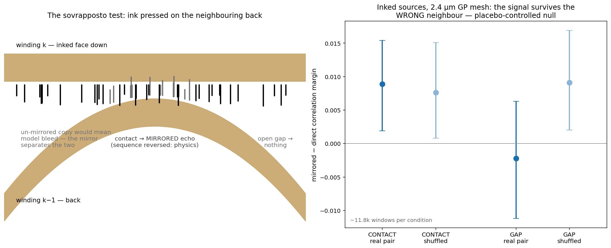

Two artifacts were caught by the in-cell sanity checks before any margin
was read: the GP mesh self-overlaps with a ~86 µm offset (the same papyrus
appears twice), and its tail survived a naive distance filter — the
final pairing defines the neighbour physically (same angle, same height,
different radius) so mis-identification is excluded by construction.

A fifth exam was added after the real-scroll campaign: the shuffled-pairing placebo, 
which the field run proved decisive — and which, run on the twin, reproduces the 
real scroll's shuffled offset (+0.10 clean vs +0.008 noisy, same sign): the estimator's 
intrinsic mirrored bias with lettered profiles, now characterized.

---

## 15 — Fiber striations inside the closed scroll

**Context.** Papyrus sheets are made of plant strips whose individual
fibers leave a fine parallel striation — a few millimeters in pitch,
unique to each sheet, like a fingerprint. Papyrologists have used this
striation for over a century to match fragments ("fiber matching"): if
the pattern continues, two pieces belong to the same sheet. Until now
this required holding the fragment under raking light. The question
here: is that fingerprint measurable in the CT of a scroll that has
never been opened?

**Result.** Yes. On the Scroll 1 GP segment (2.4 um surface volume),
aggregate spectra show a periodic intensity pattern with fundamental
period ~4.2–4.7 mm (first harmonic 8.3–9.3 mm), on both faces and in
crossed orientations — height-wise on the recto, arc-wise on the verso,
matching the two crossed strip layers of papyrus manufacture.

**Controls.** Three alternative explanations were tested and excluded:
- *Ink/text*: the pattern strengthens away from the inked surface
  (core ~155x background), and is stronger between text columns
  (~1162x) than under text (~731x).
- *Render tiling*: the dominant peak sits at ~65 px, not at the 128 px
  tile stride.
- *Crumpling*: the surface geometry undulates at other periods
  (~20 mm along arc, ~10 mm in height — itself a first measurement of
  the crush corrugation of the near-core windings); at 2–5 mm the
  geometry is smooth while the intensity is not.

**Stated limit.** At the 67 um/px render the striation is visible in
aggregate but not traceable block-to-block (baseline continuity
0.27–0.33 across four estimators (including phase tracking of the fundamental); synthetic benches with noise, drift
and shear keep >=0.85, so the limit is sampling, not method). Tracing
fibers individually — and detecting sheet joins (kolleseis) as breaks
in the striation, including joins crushed below any thickness ratio —
needs the 1.129 um data. That run is next.

**Reproduce.** `scripts/fiber_striations.py` (Colab-ready, anonymous
S3); outputs `archives/results/fiber/fiber_striations_results.json` and the
figure below.

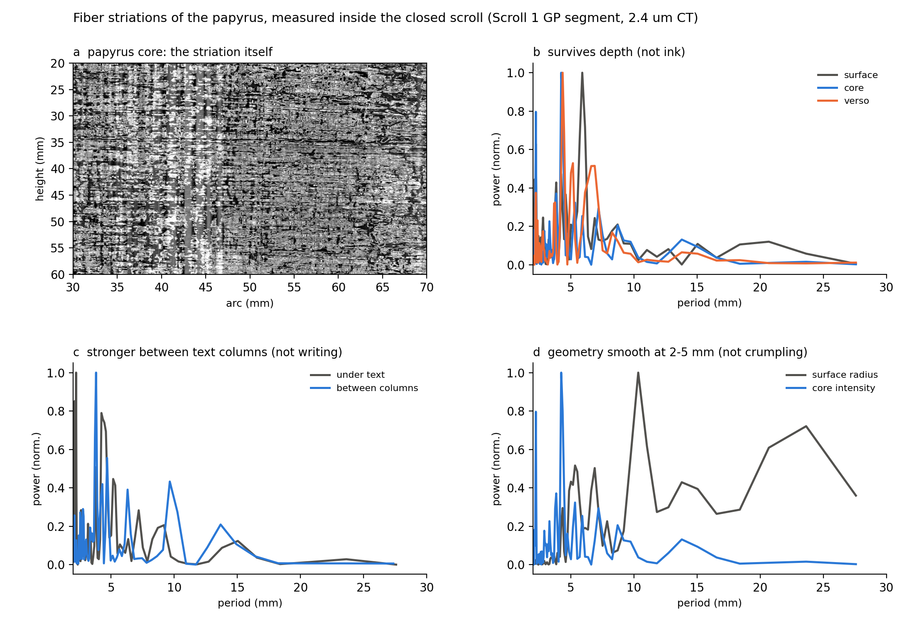

**Cross-scroll check (PHerc. 1218).** The same instruments ran on the
1218 raw volume (17 µm voxels, ray/ring geometry from the census
inputs). The crush corrugation is measured there too: 19.8 mm vertical
period, 10.2× background, over 3,363 sheet columns — against ~10 mm on
the Paris 4 near-core segment. Two scrolls, one instrument; the more
brutally crushed roll corrugates at twice the wavelength. The fiber
striation is *not* detectable in 1218, and the check was run both ways:
straight dense columns (4,025 at 17 µm steps — nothing over background)
and crest-following tracking that rides the sheet's local maximum
through its undulation (1,389 columns, matched shuffled null — still
nothing). So the absence is a property of the material, not of
sectioning a corrugated sheet. Read against Paris 4 — better preserved,
striation strong — the natural reading is that 1218's fine texture did
not survive its collapse, though one window is not the whole scroll.

The crush geometry of PHerc. 1218 (corrugation, unrolled ribbon, and where
segmentation survives) is mapped in mode 16.

---

## 16 — PHerc. 1218 unrolled: the ribbon and the segmentation census

**What it does.** Rebuilds the scroll as a single continuous ribbon from the
per-ray crossing table (60 rays × 313 slices; same source table as the
census/fence work): median radius per (winding, θ) → developed length →
radial crush relief per (length, height). A second map counts, for every
(winding, θ) cell, how much of the height column the segmentation actually
traced — the coverage census.

**Figures.**

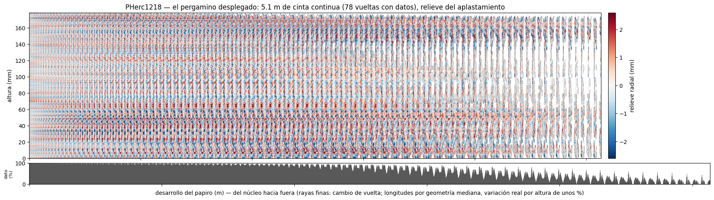

*PHerc. 1218 unrolled: 5.13 m of continuous ribbon across 78 traced
windings (winding pitch ~0.20 mm/turn; at least ~95 windings present, the
outer ~16 only as fragments). Color: radial crush relief, ±2.6 mm typical.
Coverage is sustained ≥50% out to L = 4.10 m; beyond that, only the
high-curvature rims of the flattened section survive segmentation. Lengths
from median geometry; per-height variation of a few percent. The ribbon is
~25% longer than a circular spiral of the same median radius — a geometric
signature of the crush.*

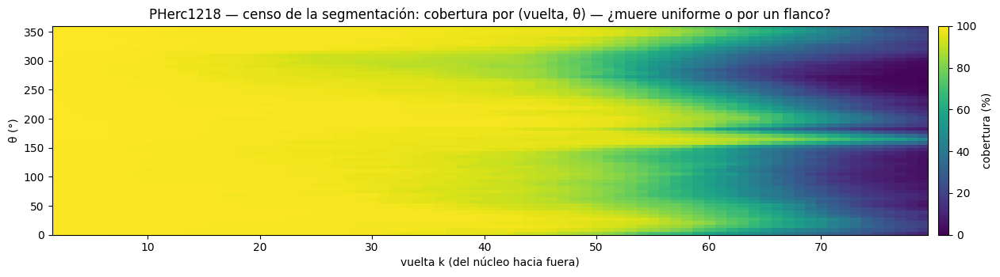

*Segmentation census by (winding, θ). Coverage decays smoothly from winding
~45 along two growing wedges — the flattened faces, where layers are
pressed together — while two nearly opposite meridians (the rims) survive
to the outermost windings. The thin dead line at θ≈180° is the fold crease
itself, matching the vertical fold stripe seen in the relief maps.*

**Numbers.** Ribbon 5.13 m; windings 2..79 usable (table reaches k=108;
k≥96 empty, k=80..95 at 1–10% coverage); pitch 0.20 mm/turn (median radius
0.58 → 16.04 mm); typical relief ±2.6 mm; sustained ≥50% coverage to
L = 4.10 m (~winding 70); perimeter excess +25% over the circular
equivalent. Horizontal relief bands repeat at fixed heights across dozens
of windings — the folding law seen along the whole ribbon.

**Limitations.** Geometry only — this places material, it does not produce
ink. Angular resolution is the table's 6° binning: a guide, not
letter-level. Median-geometry lengths; small z-gaps (≤2 mm) are
interpolated for display only, larger gaps are left blank. Windings below
10% coverage are excluded, not extrapolated.

**Status.** Instrument verified on a synthetic bench (phantom rings cut,
no edge artifacts, flank-shaped coverage recovered). Next step: the
ironing field — combining the in-plane de-crushing (mode 10/11) with this
radial relief matrix into a single 3D correction field, using the folding
law to interpolate across the dead wedges the census maps here.

**Script.** `scripts/unroll_1218.py` (Colab cell; expects the crossing
table loaded as `rows`). Figures in `figures/`.

---

## 17 — The ironing field: one folding law for all of PHerc. 1218

**What it does.** Tests whether the crush relief of the whole scroll is
separable — Δr(winding, θ, z) ≈ A(winding) · F(θ, z) — i.e. whether all
windings share ONE master fold pattern, each with its own amplitude. If
they do, the folding law becomes a predictor: in the wedges where
segmentation dies (mode 16 census), the sheet's radial position can be
predicted from the pattern, calibrated on the surviving rims of that same
winding.

**Method.** F = median across windings of the per-winding normalized
relief; A per winding by least squares. Exams, criteria fixed before
running: (1) a synthetic self-test inside the cell (fitter must recover a
planted law: corr ≥ 0.90, wedge ratio ≤ 0.60 — PASS at 0.990 / 0.52; a
negative bench with per-winding random phase yields 0.98 = the instrument
does not manufacture leverage); (2) the wedge exam on real data: for each
tested winding, F is fit *without* it, its A from its rim cells only, and
the prediction is scored on the census wedges (RMSE/σ; ≤0.70 = leverage,
0.70–0.90 = weak, >0.90 = no law).

**Result.** Leverage, by the prefixed criterion: wedge ratio 0.58
[p25 0.46, p75 0.69] over 35 windings — inner half 0.46, outer half 0.62
(the use case: still below 0.70). Full fit: median R² = 0.68 per winding
(~0.85 in the body, declining outward). The shared pattern removes 42% of
the global relief in-sample (±1.26 → ±0.72 mm). Amplitude A(k) is a
bell: ~0.2 mm at the core, peaking at ~1.17 mm around winding 42–45,
falling to ~0.43 mm at winding 79 — the crush wrinkles hardest at
mid-depth. In practice: where segmentation sees nothing, the field cuts
the radial uncertainty roughly in half (~±1.3 → ~±0.8 mm).

**Figures.**

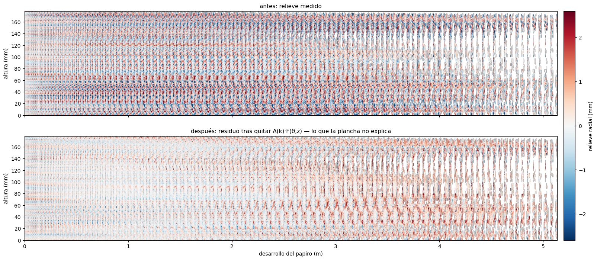

*The master fold pattern F(θ, z): the wrinkle all windings share. The
coherent vertical structure at θ≈180° is the fold crease — the same
meridian the coverage census (mode 16) shows as a dead line.*

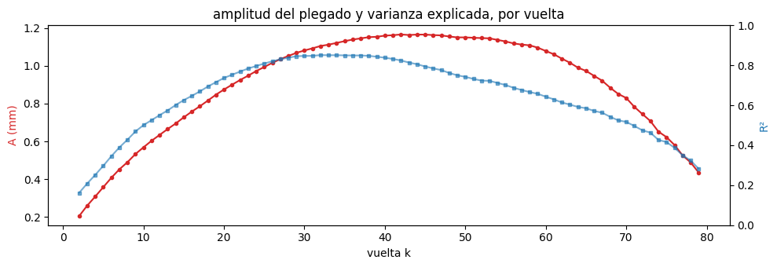

*Fold amplitude A(k) (red) and variance explained R² (blue) per winding.*


*The unrolled ribbon before and after removing A(k)·F(θ, z): what the
iron does not explain is local damage plus the second-order term.*

**Limitations.** Places geometry, does not produce ink. Angular resolution
is the table's 6° binning — a guide, not letter-level. The residual grows
outward (R² ~0.85 in the body → ~0.3 at winding 79); the first candidate
for that residual is phase drift between windings, a declared next step,
not part of this fit.

**Artifacts.** `planchado_1218.npz` (the full field Δr̂ plus geometry and
per-winding quality) and `planchado_1218_results.json` (exam numbers) —
produced by the export cell in `scripts/planchado_1218.py`.

The full displacement field this iron corrects is measured point by
point — and the sheet rebuilt label by label — in mode 18.

---

## 18 — The unwrap, v0: every label back to its origin

**What it does.** Maps every crossing in the ray-crossing table (1.35M
points, windings 2–79) to its intrinsic position on the flat sheet
(developed length × height) and back onto an ideal pre-collapse spiral
fitted to the median radii (pitch 0.197 mm/turn, r0 0.97 mm). Nothing is
predicted or interpolated: where the table has no data, the sheet has a
hole, and the hole is information.

**Frame.** The table-to-volume frame is iyando's convention
(pitch_qa.py `ray_metrics()`), with per-slice origins from
origins_merged.csv (duplicates deduplicated by averaging; global
CT↔labels offset (−3,−1) voxels). Cross-validated two ways: our blind
self-registration recovered the mid-slice origin to ~10 voxels before
knowing it, and the duplicate statistics reproduce the published ones
exactly.

**Figures.**

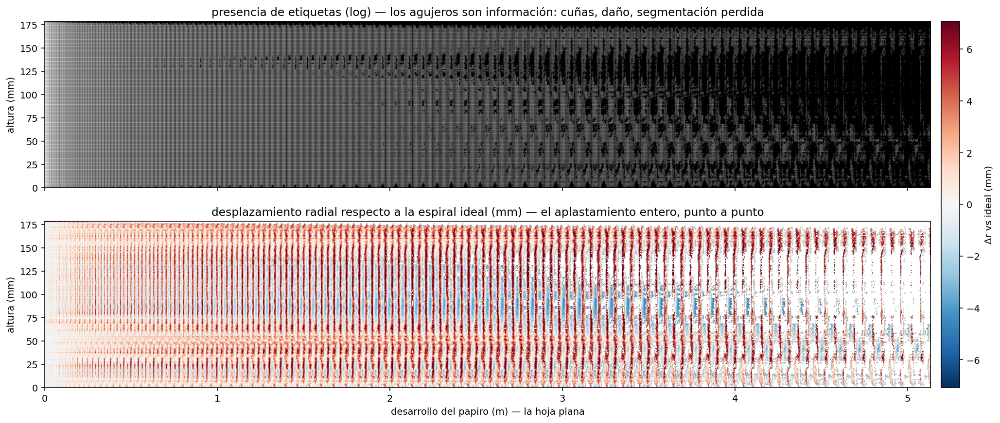

*The flat sheet: label presence (top; holes = wedges, damage, lost
segmentation, drawn by absence) and per-point radial displacement vs the
ideal spiral (bottom) — the collapse of PHerc. 1218 measured point by
point: median 1.2 mm, 95th percentile 5.9 mm.*

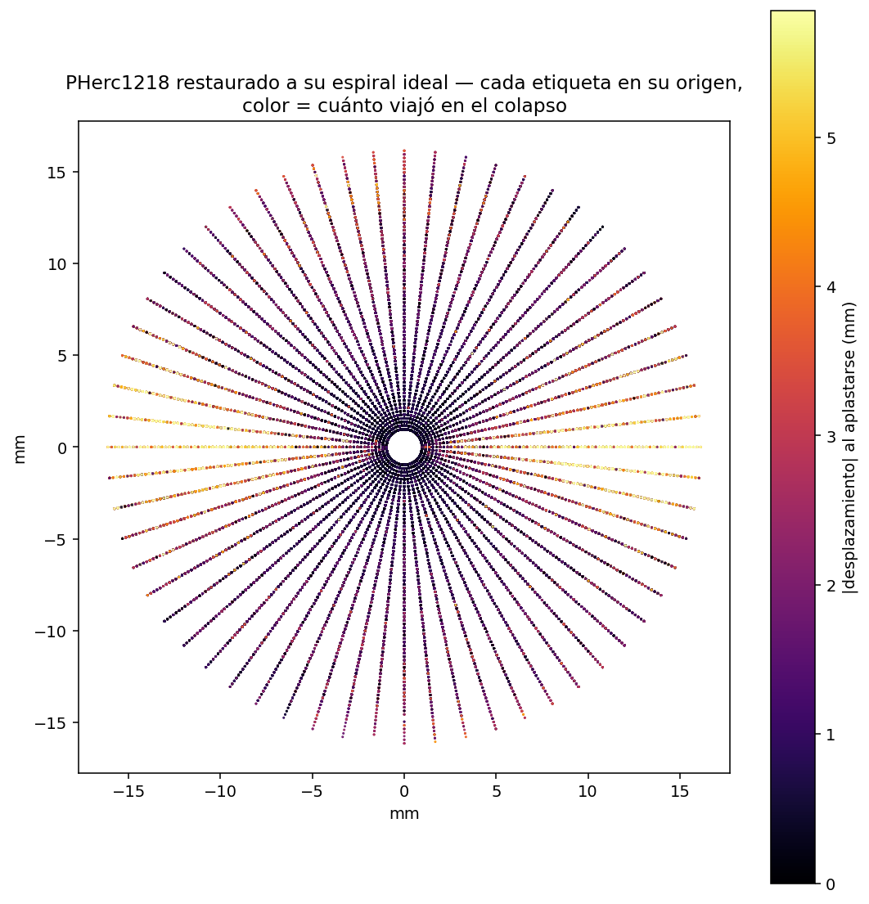

*The scroll rewound to its ideal spiral, color = how far each point
travelled in the collapse. The bright horizontal rays and dark vertical
ones are the vertical crush seen from the original state: the long axis
moved out, the short axis moved in.*

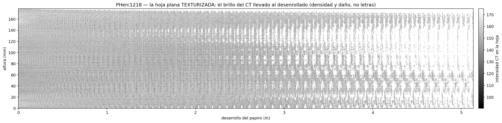

*CT intensity carried onto the unwrap. This shows density and damage
mapped on the sheet — not ink: at 17 µm the layers are in full contact
and single-ray brightness carries no layer-locked signal (flat
anchor-stacked profile; radial decorrelation length ~50–70 µm, not
anchored to the crossings). The per-winding vertical patterning growing
outward is the rim/face alternation of the census (mode 16).*

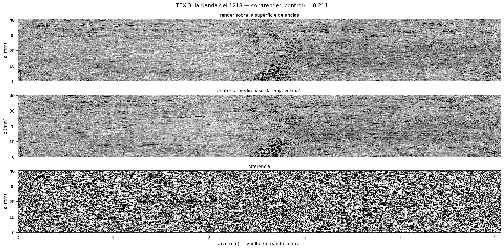

*The receipt for the brightness null: a band of winding 35 rendered on
the anchored surface (top), the same render displaced half a layer
pitch — where the neighbouring sheet would be (middle), and their
difference (bottom). The two renders share all large-scale structure
(density, damage — note the dark streak, a candidate radial crack) and
differ only in fine-scale noise: brightness does not know which sheet
it is on.*

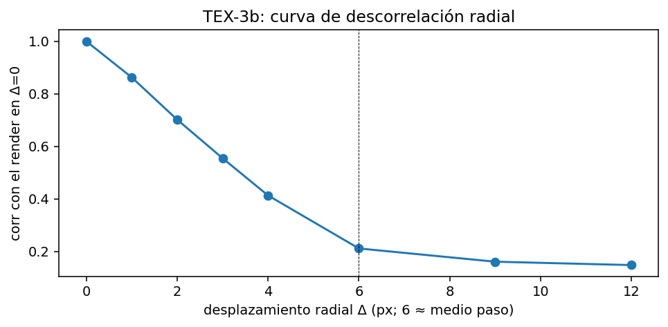

*Radial decorrelation of the render: correlation decays gradually
(0.86 at 17 µm, floor at half a pitch), so radial structure with
~50–70 µm coherence does exist — it is simply not locked to the sheet
crossings. Documented for future work at finer scales.*

**Numbers.** 1,348,078 crossings mapped; displacement |d| median
1.21 mm, p95 5.85 mm; ideal spiral pitch 0.197 mm/turn. The reliable
domain converges with the coverage census (mode 16): windings 2–66,
L ≈ 4.1 m — two independent instruments agreeing on where the data ends.

**Limitations.** Angular resolution is the table's 6° binning; developed
lengths from median geometry; the wedges are holes, not predictions (the
ironing field of mode 17 predicts them separately, with its own measured
error). Texture is density/damage, not letters — the brightness null is
documented above and in the exam chain.

**Next.** With per-voxel labels the same mapping yields the
full-resolution unwrap, a per-point sheet-thickness map in flat
coordinates, and a geometric QA of the labels themselves (self-overlaps
and sheet-switches become visible artifacts in flat space) —
conversation opened with the labels' author.

**Scripts.** `scripts/unwrap_labels_1218.py` (presence + displacement +
restored scroll), `scripts/unwrap_texture_1218.py` (CT intensity on the
unwrap). Both need only the crossing table; the texture script also
reads the L1 volume.

---

## What the twin was asked to do — and what came back

The synthetic twin (Mode 7) is the only tool here that produces data rather than
consuming it, and that makes it good for exactly one class of problem: **breaking a
confound that real data cannot break.** Two such problems were put to it, both asked
for rather than invented — and both have now been run, by other hands.

**Separating faint from compressed** became Mode 12. Run end-to-end by aviad12g over
a frozen production checkpoint (five generation seeds, controlled-FPR readouts), it
returned the third outcome — the one invisible in real data: the response moves on
**both** axes, contrast and geometry, with a modest interaction (~0.05).

**Calibrating a fusion detector** became the three-handed fusion readout: this
repository's geometry supplied exact gaps, aviad12g's frozen runs supplied the
probabilities, and Jinhojeong's ray instrument counted — the first measurement of
fusion rate against exact gap size. The finding: at detected contacts the checkpoint
bridges neighbouring sheets at a flat 75–78 % across 10–150 µm of true air gap, so
fusion is **not** a tight-gap phenomenon there, and the PHerc1218 anisotropy question
moves from gaps to detection-versus-contrast — which the preregistered fixed-geometry
follow-up is built to answer. (The same welding trick had earlier calibrated the
winding-count invariant to a floor of ≳7 % of a slab's windings.)

What the twin cannot do, and should not be asked to: it is a prism, identical top to
bottom, with two analytic folds and no tearing. **That prism assumption now has a
price tag**: a single section profile fits a given CT slice to 1.1–2.8 mm, while
that slice's own measured profile fits to 0.66–0.83 mm (see Mode 11B). So
`--section-profile` taking one shape for the whole roll is itself an
approximation worth about 2 mm of section error, and the natural next step is to
let it take a profile per height, which the data already contains. It does not reproduce the complexity
of real deformation and comparing its slices with real CT by eye would be pointless.
Its value is that the answer is known, not that it looks convincing — and the modes
above use it as a unit test with ground truth, never as evidence about a real scroll.

---

## Supporting analyses
- `scripts/experiment_A_degradation.py` — controlled-degradation validation of the
  metric (rotation, shear, warp, noise, erasure): the score falls monotonically, which
  is the calibration a ranking metric needs.
- `scripts/delta_beta_ink.py` — δ/β contrast of lead-bearing ink vs papyrus from
  tabulated scattering data. Key result: the exploitable channel is **K-edge
  subtraction (~88 keV)**, not differential phase — with the caveat that
  phase-retrieved public volumes may suppress exactly that absorption signal.
- `scripts/make_rank_candidates.py` and `scripts/orient_acceptance_test.py` —
  the acceptance tests for the `rank` and `orient` modes. They ship with the
  code deliberately: every mode in this repository carries the test that
  gates it, including the ones that failed before they passed.

---


## Lessons (kept on purpose)

**The recurring failure has a shape.** Most errors recorded in this repository
were not wrong facts but wrong *comparisons*: two quantities that measure the
same thing in different conventions, compared as though they shared one. Exam A
of Mode 11 compared a function against its own inverse on the same grid. The
sheet was compared against a ground truth numbered from the opposite end. Each
slice was compared against a median of 313. Each looked like a substantive
result until the comparison was checked, and none was caught by inspecting the
answer — only by testing the instrument.

Our first line-spacing estimate (4.45 mm) was a resolution artifact: on a 13 mm strip
the FFT has only 3–4 usable bins in the whole 3–8 mm range, and the "peak" was bin
k = 3 of the strip height. Finding it, fixing it (cycle gating + spatial-domain
estimation) and reporting it is part of the method. Earlier script versions live in
`archives/`, each superseded by the integrated `scripts/grid_metric.py`.

## What is in this repo

```
vesuvius-topological-grid/
├── README.md
├── LICENSE.md
├── LOGBOOK.md
├── requirements.txt
├── docs/
│   ├── technical_note_revised.pdf     ← the technical note (start here)
│   └── data_sources.md                ← how to obtain the input images
├── scripts/
│   ├── synthetic_scroll_twin.py       ← the twin: obra → scroll → crush
│   ├── text_layout_predictor.py       ← the falsifiable column map
│   ├── fibre_strain.py                ← where the crush cracks the sheet
│   ├── contrast_phantom.py            ← faint vs compressed (mode 12)
│   ├── kollesis_detector.py           ← sheet joins by double thickness (mode 13)
│   ├── band_sensitivity.py            ← is a period image or band-artefact?
│   ├── displacement_field.py          ← unroll and diagnose (mode 11)
│   ├── work_size.py                   ← work ↔ roll size, and the
│   │                                     unknown-work discriminator
│   ├── void_aware_expected_n.py       ← layer-count reconciliation
│   ├── orient_acceptance_test.py      ← acceptance test for orient mode
│   ├── grid_metric.py                 ← analyze / compare / rank
│   ├── make_rank_candidates.py        ← acceptance test for rank mode
│   ├── phase_tracking.py              ← period-phase search; phase glitches
│   ├── epoch_folding_prototype.py
│   ├── experiment_A_degradation.py
│   └── delta_beta_ink.py
├── figures/                           ← output figures
└── archives/                          ← earlier script versions + results
```

## Quick start

```bash
# 1. Clone
git clone https://github.com/Diego-dcv/vesuvius-topological-grid.git
cd vesuvius-topological-grid

# 2. Environment (Python 3.10+)
python3 -m venv venv
source venv/bin/activate                # Linux/macOS   (venv\Scripts\activate on Windows)
pip install -r requirements.txt

# 3. Get the input images — see docs/data_sources.md for permanent links.
#    You need at least one rendered surface (PNG/WEBP) from Paris 4.

# 4. Measure the scribe's grid on one surface
python scripts/grid_metric.py analyze IMAGE.png --width-mm 129

# 5. Compare two ink predictions of the same region
python scripts/grid_metric.py compare A.png B.png --width-mm 129 --label-a Model_A --label-b Model_B

# 6. Screen several candidates of the same region (external reference required)
python scripts/grid_metric.py rank candA.png candB.png candC.png \
    --width-mm 129 --letters-mm 1.83 --lines-mm 2.79

# 7. Detect buried line structure by epoch folding
python scripts/epoch_folding_prototype.py --input surface.png --width-mm 129 --noise-test

# 8. Search the period and phase, and track the phase for glitches
python scripts/phase_tracking.py search IMAGE.png --width-mm 129 --axis lines

# 9. Map the local tilt of the writing baseline
python scripts/grid_metric.py orient IMAGE.png --width-mm 129 \
    --letters-mm 1.83 --lines-mm 2.79

# 10. Void-aware layer-count reconciliation (runs its acceptance test with no args)
python scripts/void_aware_expected_n.py

# 11. Build the synthetic twin for a work of N columns (no input images needed)
python scripts/synthetic_scroll_twin.py build --columns 95 --script greek \
    --csv twin_truth.csv --plot twin.png

# 12. What the crushed section implies about the length of the work
python scripts/synthetic_scroll_twin.py sweep --script greek --plot sweep.png

# 13. Sheet joins: the kollesis landmarks and their angular chirp
python scripts/synthetic_scroll_twin.py kollesis --columns 95 --plot koll.png

# 14. Export a voxel volume as a test bench (fused turns, crossed fibers)
python scripts/synthetic_scroll_twin.py volume --columns 95 --z-window 8 \
    --voxel-um 60 --fuse 20,24,60,150 --fibers --out twin_vol.npy

# 15. The falsifiable column map for the real scroll; anchors tighten it
python scripts/text_layout_predictor.py predict --columns 95 --csv map.csv
python scripts/text_layout_predictor.py calibrate --anchors anchors.csv

# 16. What the implied work depends on (never quote a figure without this)
python scripts/synthetic_scroll_twin.py sensitivity

# 17. Where the crush cracks the sheet, and where it leaves it intact
python scripts/fibre_strain.py map --plot fibre.png

# 18. Which work fits a measured section, and which rolls match nothing
python scripts/work_size.py identify --section 42 21
python scripts/work_size.py population --section 42 21

# 19. Acceptance tests (no arguments, no data required)
python scripts/synthetic_scroll_twin.py test
python scripts/text_layout_predictor.py test
python scripts/fibre_strain.py test
python scripts/work_size.py test
python scripts/phase_tracking.py test
python scripts/displacement_field.py test
python scripts/contrast_phantom.py test
python scripts/kollesis_detector.py test
```

Steps 10-18 need no input images: everything from mode 7 onward runs on
geometry alone. The twin and the predictor run on geometry
alone.

Scripts write PNG figures (and CSVs) to the working directory. A Paris-4-sized image
analyses in under a minute on a laptop.

## Use case
The tool does not read new letters or replace existing segmentation methods. It offers a
quality-assurance and arbitration layer that integrates as a callable step alongside
existing pipelines (Henderson spiral fitting, Thaumato Anakalyptor, Volume Cartographer,
VC3D) without modifying their architecture: rank candidate surfaces by grid survival,
localize zones where the grid breaks, and measure agreement between independent ML
readings.

## Declared limitations
- **The grid measures geometric regularity, not textual correctness.** A coherent grid
  is necessary but not sufficient: a model can produce coherent hallucinations. Final
  calibration needs papyrological ground truth held by the Vesuvius Challenge team.
- **Signature calibration needs a minimum well-resolved region** to extract the
  per-scribe periods; fully compressed scrolls without a clean zone need an external
  reference value (this is what `rank --letters-mm/--lines-mm` is for).
- **Atypical zones legitimately lack the grid** — margins, intercolumnia, tears, pin
  holes, illustrations — so the tool should be paired with a zone-type prior before its
  flags are read as errors.

## Community validation
The winding-count invariant (§2 of the technical note) has been independently
implemented and scaled by other Vesuvius Challenge contributors — as a (z, θ) ray
profile on stitched PHerc1218, and as a 35-scroll winding atlas. Their formulations
improve on the bare invariant and are credited in the note's next revision; details and
links live in the technical note and the community threads.

## Integrity note
Nothing here reveals or reconstructs hidden text. Per Vesuvius Challenge rules, any
actual text recovery requires the team's written approval before public posting; these
tools are methodology only. Developed with AI assistance under a documented
human-in-the-loop workflow; all quantitative claims are regenerated by running the
scripts.

## Citation
> Diego_dcv (2026). *vesuvius-topological-grid: an ML-independent structural metric
> for Herculaneum scroll surfaces.* Zenodo. https://doi.org/10.5281/zenodo.21464028


## Contact
Diego — Madrid, Spain. For substantive technical discussion, please open an issue in
this repository.

## License
MIT License (see `LICENSE.md`). Offered as a contribution to the open scientific effort of
the Vesuvius Challenge. It does not claim priority on any specific finding; if
equivalent approaches have been explored internally by the team, the author would be
glad to be informed.
