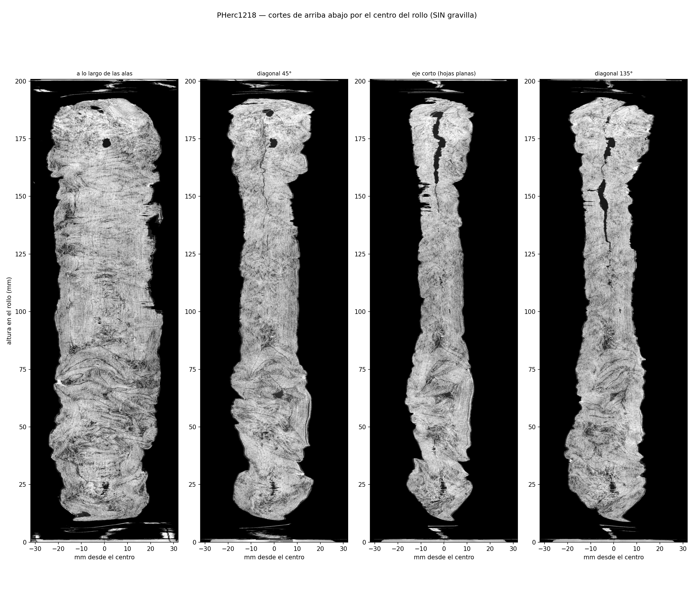
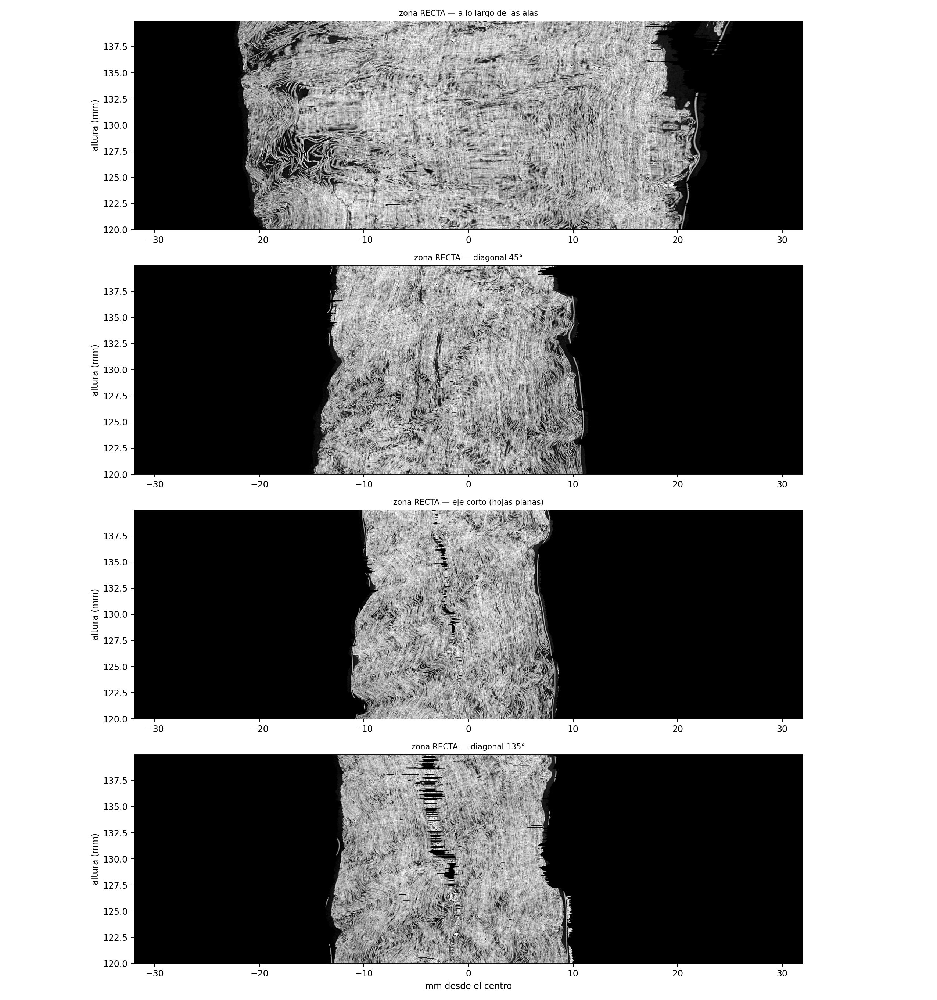
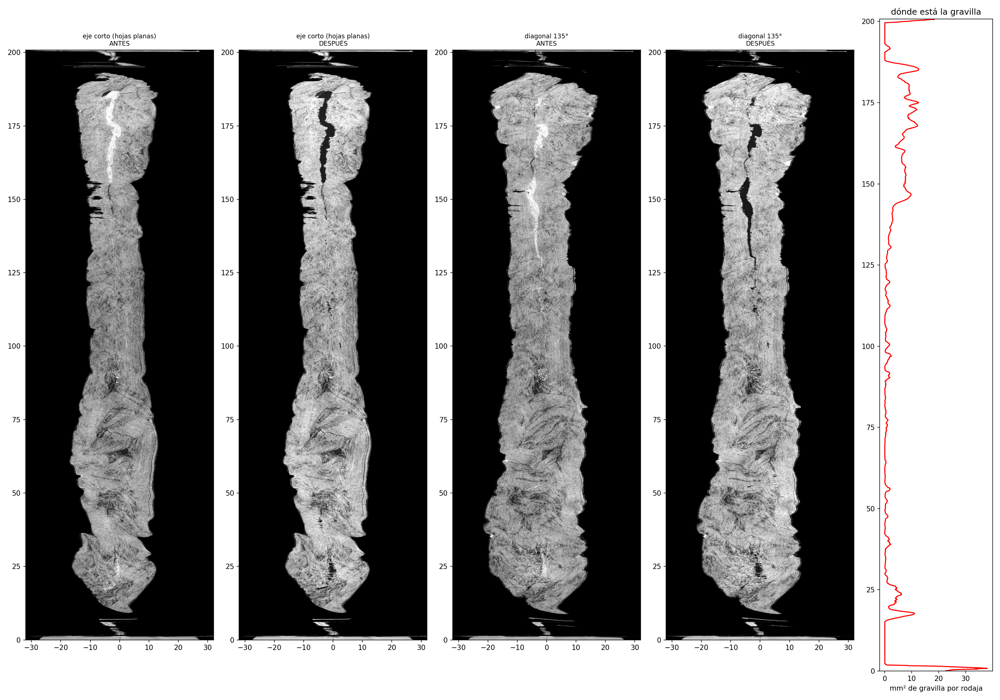
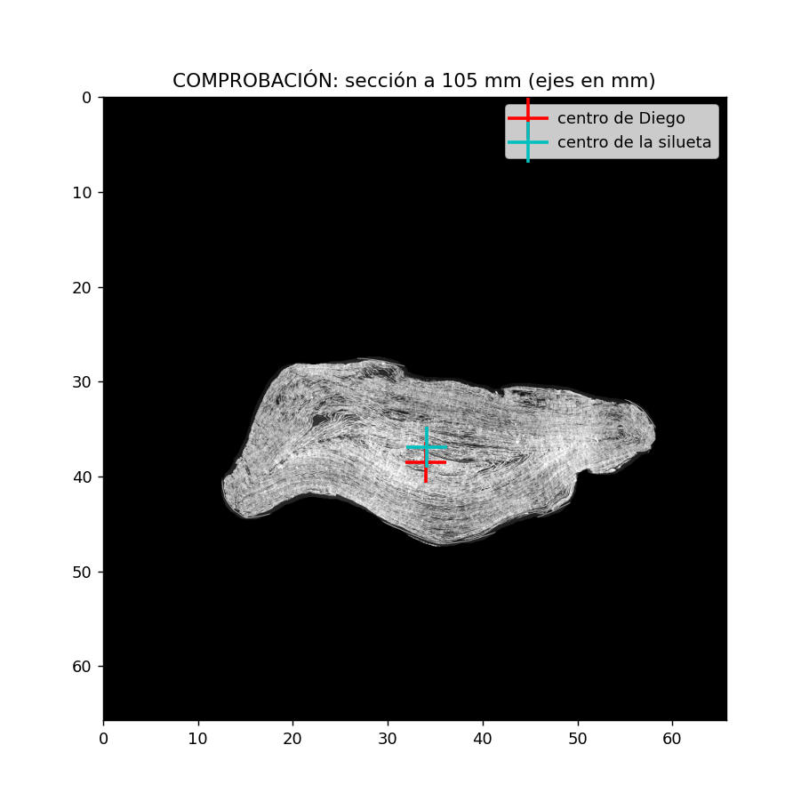
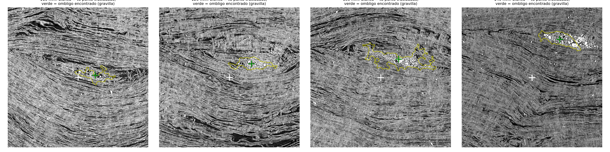
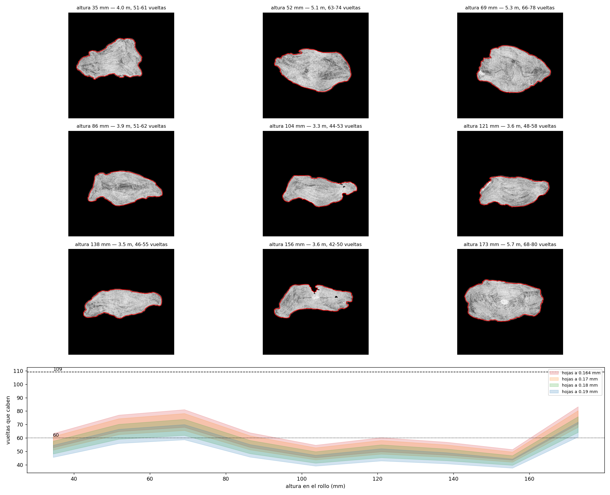
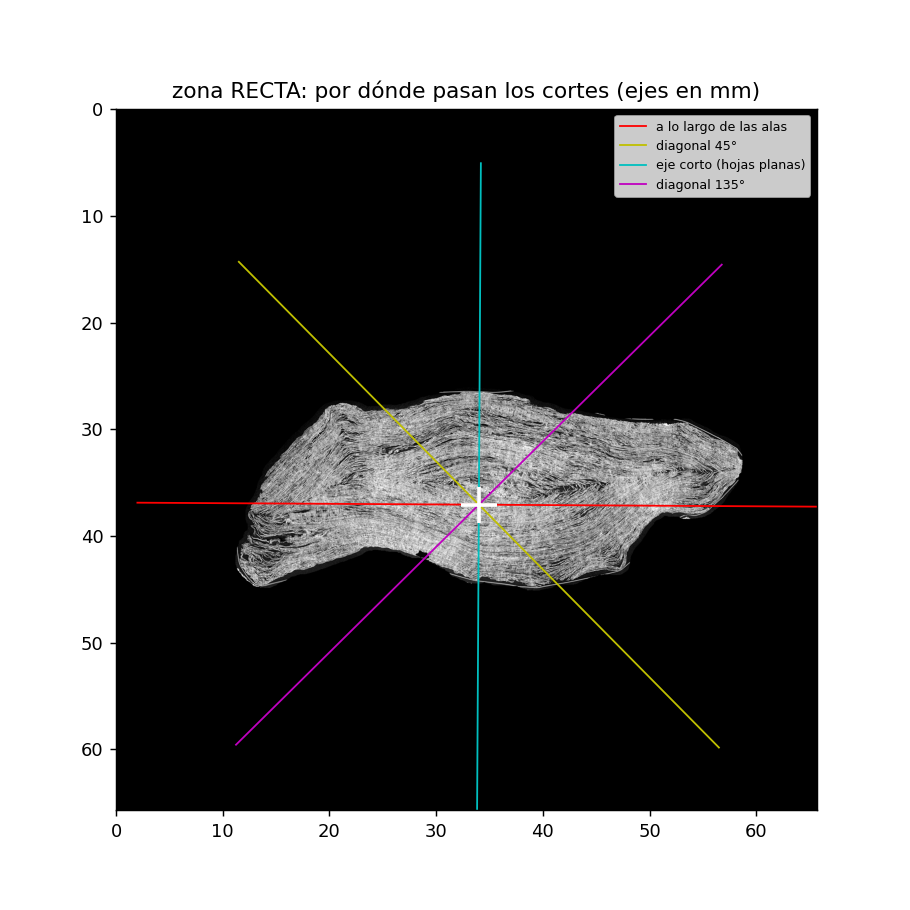
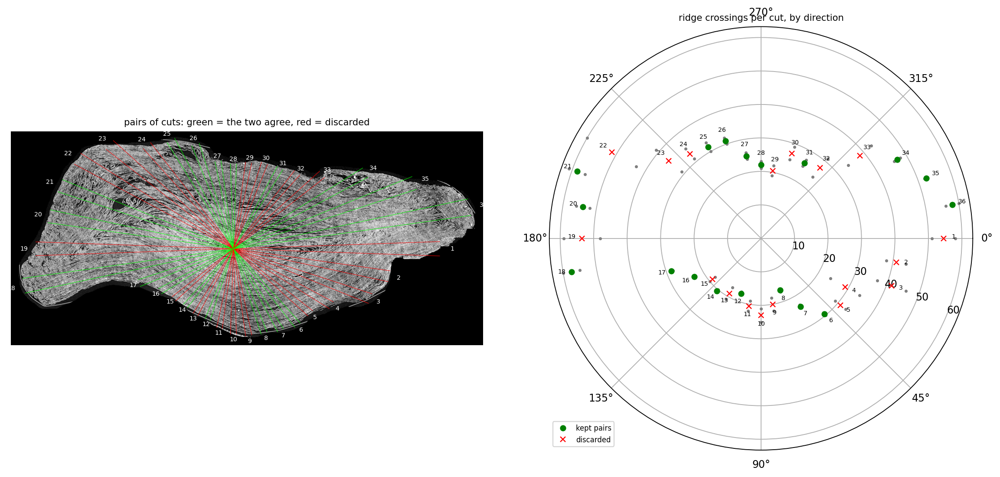
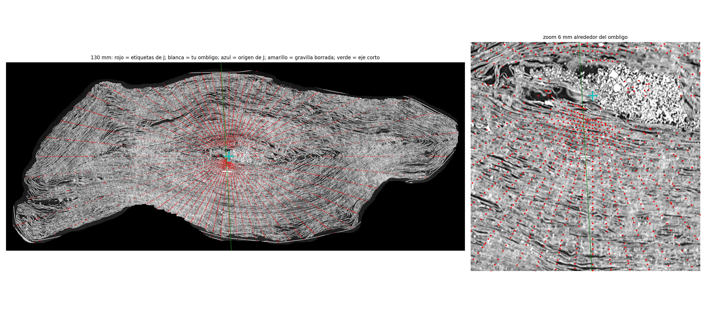
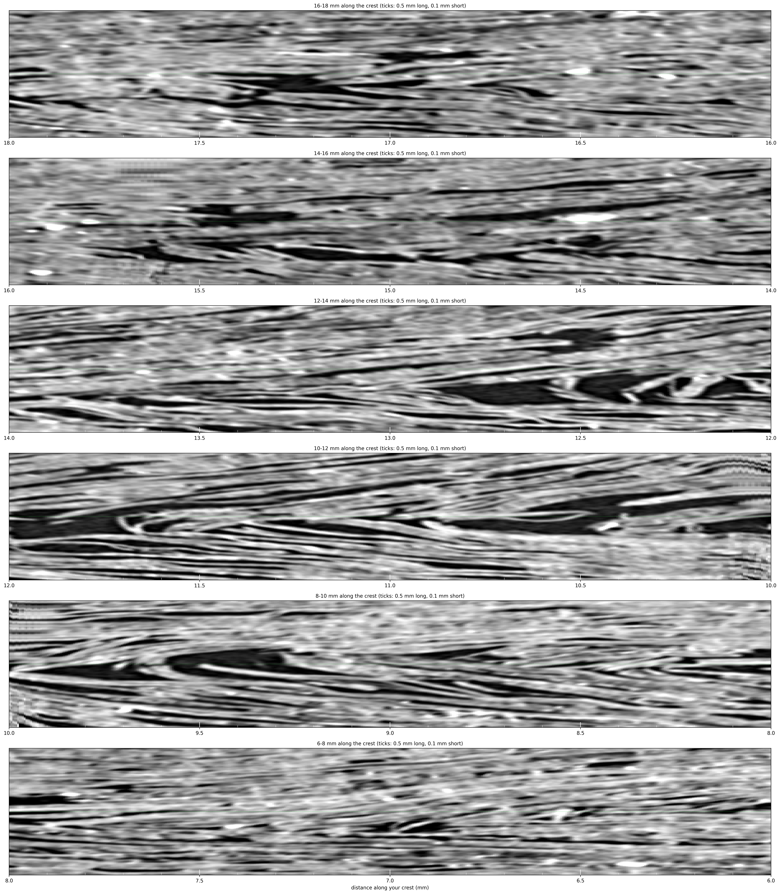

# The geometry of PHerc. 1218 — what the scroll looks like inside

*September 2026. Figures in `figures/55Turns/`. Not final until the open points in section 7 are closed.*

This page collects what was measured in September 2026 about the shape of PHerc. 1218: how many turns it has, how much papyrus it holds, how it was crushed and where it is damaged. It replaces several figures stated earlier in this repository; the corrections are listed in section 8.

Sources: the public masked CT volume (8.64 µm, levels 0-3) and the public crossing table of the per-voxel labels (Jinhojeong/vesuvius-surface-geometry-diagnostic). Every experiment had its verdict fixed before it was run and was first tested on a synthetic scroll with a planted answer.

## 1. The vertical section

Cutting the scroll top to bottom through its centre, instead of in horizontal slices, shows three zones:

- **Crumpled zone, about 20-90 mm.** The sheets are folded along the height (zigzags, S-folds). In places the outer layers on one side stay straight while the inner ones are folded.
- **Straight zone, about 100-155 mm.** The sheets run almost vertically. Only here does a horizontal slice cut each sheet once.
- **The two ends.** The low end is crushed and curled; the high end is domed and nearly round in section.

This shapes everything else. In the crumpled zone a horizontal slice cuts folded sheets obliquely or several times, so any per-slice measurement overstates the papyrus there. Counts and lengths are taken in the straight zone.

*Four vertical cuts through the centre of the scroll (along the wings, the two diagonals and the short axis), with the gravel in the umbilicus removed.*

*The straight zone enlarged (120-140 mm): the sheets run almost vertically.*

## 2. The umbilicus

The centre of the scroll is an open channel, not a solid core. In the vertical section it is a narrow void running from the top down to about 125 mm. It is partly filled with a granular material of mixed density that contains grains dense enough to saturate the scan; the same grains appear along cracks elsewhere. The fill is concentrated near the top (145-190 mm) and near the bottom (17-25 mm), which suggests it entered through the open ends of the channel. Its nature is not measured.

The channel is not straight. Its position drifts by 1-3 mm between 110 and 140 mm in height (the S-shaped axis noted in August). A method that assumes one fixed centre for all heights assigns sheets to the wrong side of it.

*Short axis and 135° cut, before and after removing the fill of the umbilicus. Right: fill area per slice along the height (the peaks at 0 and 200 mm are the scanner support).*

*The section at 105 mm with the centre used throughout (red) and the centre of the silhouette (cyan).*

*The umbilicus found at 110, 120, 130 and 140 mm (green) against the 105 mm centre carried up unchanged (white): the channel moves 1-3 mm.*

## 3. How much papyrus is in a slice

A slice cannot hold more papyrus than its area divided by the spacing between sheets. Measured at nine heights (silhouette area from the CT, spacing 0.164-0.19 mm), this ceiling is 3.3-5.7 m per slice and at most about 80 turns. The earlier figures of 109 turns and 8.4-9.4 m do not fit in the scroll.

The labelled papyrus is 62-68 % of this ceiling at every height and rises and falls with it. The two measurements are independent (CT silhouette vs. labels), so each validates the other. About one third of the papyrus in a slice is unlabelled, not 60 %.

The highest ceilings come from the crumpled zone and are inflated by it (section 1). In the straight zone the ceiling is about 3.5 m.

*Silhouette of the slice at nine heights and the number of turns that fit in it for several sheet spacings.*

## 4. The number of turns

Turns were counted in the straight zone along the short axis of the section, where the sheets are flat and have no hairpins, starting from the umbilicus found at each height and counting upwards and downwards. Only waves of the size of one sheet (0.12-0.25 mm) are counted, so the two fibre layers of a sheet are not counted twice, and two sheets pressed together without a gap still count as two.

- At 120 mm the upward and downward counts agree (53 and 51): **52 turns outside the umbilicus, plus about 3 estimated inside it: about 55 turns.** Reliable range 52-58.
- The mean of the upward and downward counts does not depend on where the centre is placed: 55, 52, 49 and 46 at 110, 120, 130 and 140 mm.

*A slice of the straight zone with the umbilicus (white) and the four cut lines; the short axis is the cyan line.*

*Pairs of converging cuts at 105 mm. Green: the two cuts of a pair agree; red: discarded. Inspected by eye, only cuts towards the flat faces cross each sheet once; cuts through the wings cross hairpin folds even when a pair agrees.*

The figure of 109 in the crossing table is the highest crossing number found along any ray. It is reached in the wings, where rays cut hairpin folds, and is an upper bound, not a count of turns.

*The labels of the crossing table (red) on the cleaned slice at 130 mm, drawn along the 60 rays from their own origin (cyan). Near the wings each ray crosses the same sheet several times.*

## 5. How the scroll was crushed

The spacing between sheets on the short axis (about 166 µm) equals the mean spacing of the whole slice. The sheets therefore lie as a stack of parallel sheets at constant distance from one another: a flat central slit (the crushed umbilicus) wrapped by turns with flat faces and folds at the two ends. They were not squeezed on the short axis and spread in the wings, as a crush into scaled ellipses would produce; the August twin assumed that, and the assumption is withdrawn.

*Along the fold crest of the left wing at 105 mm, 6 to 18 mm from the centre (finest resolution, true proportions). From about 8 mm outwards, sheets turn around in pointed hairpins with air inside; between them, pressed packs run straight past. The folds are pointed and drawn out, not round.*

A consequence of the stacked geometry, not an independent measurement: the original winding pitch equals the present spacing, about 0.17 mm.

## 6. Open points

1. **The count depends on the sheet spacing.** The counter and the ceiling both rest on a spacing of about 0.17 mm. If the fine bands of about 0.10 mm seen at the finest resolution were whole sheets, there would be 90-100 turns. An isolated sheet measures about 95 µm with fibre layers of about 50 µm, and fragments of PHerc. 1667 show 100-150 µm per sheet; both favour 0.17 mm, but the dependency is stated here.
2. **Fewer turns cross the short axis higher up** (55 to 46 between 110 and 140 mm) while the slice keeps its area and the spacing is unchanged. Folding a sheet cannot remove crossings from a straight path out of the centre, so the cause is not known. One reading, not measured: the crumpled paper also folds towards the centre and the section widens while keeping its compactness.

## 7. Figures in this repository that this page supersedes

| earlier | now |
|---|---|
| 109 turns | 109 = highest crossing number on a ray (upper bound); turns ≈ 55 (52-58) in the straight zone |
| loom of 8.4-9.4 m | papyrus ceiling ≈ 3.5 m per slice in the straight zone |
| ~60 % of the papyrus unnamed | about one third unlabelled |
| crush into scaled 2:1 ellipses (August twin) | stack of parallel sheets; the August twin's assumption is withdrawn |

## Cells and scripts

Colab cells (self-contained): `celda_colab_carrete.py`, `celda_colab_corte_largo.py`, `celda_colab_gravilla.py`, `celda_colab_contar_vueltas.py`, `celda_colab_pared_por_altura.py`, `celda_colab_etiquetas_limpio.py`.
