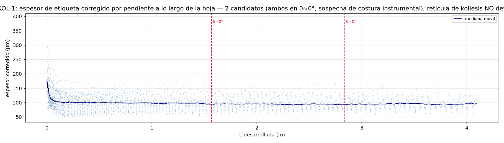
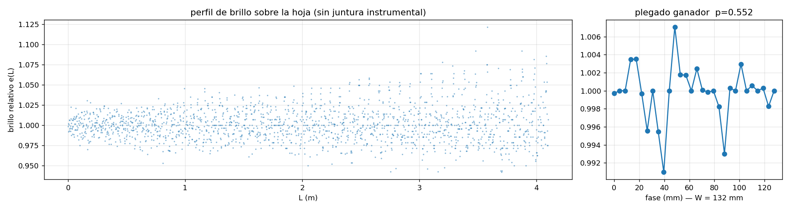

# 13 — Kollesis detector: finding the sheet joins

*Moved unchanged from the README on 2026-09-06; the README now holds only the summary. Figures and scripts are referenced relative to the repository root.*

A kollesis join is double papyrus — two sheets glued with a ~15 mm overlap —
and double thickness is pure geometry: no ink, no model, no labels. Counting
joins counts sheets, and sheets × the kollema width give a roll length
measured independently of the spiral.

The detector casts rays through a section, cuts them into material runs, and
flags a run as join-like when it is doubled against the per-ray median
(1.6–2.6×), isolated (both ray-neighbours single), and persistent across
neighbouring rays at the same radius. It reads geometry only — intensity is
deliberately not used, because in the twin the joins' brightness is painted
by us, and a detector graded on it would be grading its own assumptions.
The twin's exported `kollesis_mask` provides exact ground truth to score
against:

    python scripts/kollesis_detector.py test

**Status: all three acceptance exams pass.** Against ground truth the
detector finds all joins at 0.95 precision after the lattice fence, which
is fitted blind on the detected flags and recovers a kollema width of
165 mm against the twin's true 160. The joins-free control drops from 47
false flags to 17, inside the criterion's ceiling of 18 — with little
margin, and stated so. The script's docstring carries the diagnostic
record.

---

### Mode 13, addendum — the real run, at last: three nulls

*Evidence: `REAL-DERIVED` (label-thickness field, third-party full-res
run) + `RAW CT` (brightness) — measured nulls, sensitivity floors
declared.*

**The missing observable arrived.** This mode stopped honestly in its
day: the crossing table carries no thickness. The full-resolution
per-point run of the labels (mode 18 v0.5, executed by their author on
the 5.2 GB pre-repair tree) produced a per-cell radial-extent field —
anchored before use: at near-zero local slope its median settles at
93 µm p10–p90 (≈115 µm of sheet, right where physical papyrus sits),
with a measured, mild slope covariate. A label-thickness field, named
as such — not material thickness.

**Three searches, prefixed criteria, three nulls.**

1. **Direct bands (KOL-1).** Kollesis candidates = 4–35 mm bands, ≥40%
   over the local baseline, ≥60% vertical coherence (a join is
   full-height; damage is patchy). Expected ~20 joins over the reliable
   4.1 m; found **2**, both narrow — and both sitting at θ ≈ 0°, our
   own coordinate seam, which makes an instrumental origin the first
   suspect. Their loci are recorded for a raw-CT check (L = 1.569 m,
   windings 40–41, r ≈ 789 vox; L = 2.838 m, winding 57, r ≈ 993 vox).
   The θ-shuffled control found zero. **No lattice.**

2. **Folded thickness (KOL-2/4a).** Weak joins could hide individually
   and emerge stacked at the factory sheet width W. Epoch folding of
   the corrected thickness profile, against a 40 mm block-permutation
   null: first over W = 120–260 mm (p = 0.19) — a window that turned
   out to be half wrong: the literature puts Herculaneum kollema
   lengths at **6–19 cm, varying per roll** (PHerc. 163: 12–13 cm), so
   the scan was re-run over the papyrological window 60–190 mm at
   0.05 mm steps (at small W, 1 mm of error dephases ~70 periods):
   best W = 171.5 mm at **p = 0.57**. Null in both windows. Two method
   errors were caught by the synthetic power bench before any verdict
   and are part of the record: the W scan was initially too coarse to
   stay in phase, and the first significance control (circular shifts)
   was broken — shifting a periodic profile leaves it periodic. Both
   fixed, verdicts re-run.

3. **Folded brightness (KOL-3/4b).** The construction argument: joins
   were smoothed for the scribe's face by paring and *burnishing* — and
   burnishing compresses rather than removes, so a join should be
   denser even where it is no thicker. Same folding machinery on the CT
   brightness carried onto the unwrapped sheet (instrumental seam rays
   excluded by declaration): 120–260 mm gave p = 0.55; the
   papyrological window 60–190 mm gave best W = 94.9 mm, elevation
   1.46%, **p = 0.22**. Null in both windows, on a 2.1% rms profile.

**What the nulls mean, exactly.** The bench-measured sensitivity floor
is ~5% periodic elevation for ~8 mm bands (at 3% profile noise; the
brightness profile came in at 2.1%). So: PHerc. 1218's pre-repair
labels and its 17 µm brightness carry **no kollesis signature above a
few percent** — not that the joins are absent. The remaining routes are
declared: a raw-CT look at the two flagged loci, the repaired v2
labels, and fiber-orientation discontinuities at high resolution
(Paris 4, 1.129 µm) where a join should break the fiber pattern of two
sheets.

**A null is only worth its calibration — so the detector was calibrated.**
The labels' author supplied 63 documented fusion loci (welded sheet
contacts) from his own repair pass. Against 400 matched control cells,
the thickness field responds at those loci with a median ratio of
**1.21 [0.88–1.55]** versus **0.98 [0.73–1.32]** for the controls. So the
field does see real welds, at roughly **+20%** — not the ×2 a textbook
double thickness would give, because a locus is a point and a cell
averages ~350 of them. Three consequences, stated plainly:

- the **folded** searches (KOL-2/3/4) keep their meaning: their measured
  floor of ~5% sits well below a +20% real response, so the nulls are
  nulls against a signal the instrument demonstrably detects;
- the **direct band** search (KOL-1), which demanded ≥40% elevation, is
  **degraded**: it is insensitive at solder scale and is reported as
  such, not as evidence of absence;
- the **brightness** null is untouched — it never used the labels.

One caveat carried openly: those 63 loci cluster toward θ ≈ 0° (9 of 63
within 10°, against 3.5 expected uniform), the same meridian as our two
surviving candidates. His pipeline and ours drink from the same labels,
so this is not two independent witnesses. Either the crease edge really
does concentrate welding — which is what the physics of maximum pressure
would predict — or both inherit a frame artefact. Only the raw CT
settles it, and that check is requested.

*Slope-corrected label thickness along the unwrapped sheet. No join
lattice; the two surviving candidates sit at the instrument's own
θ ≈ 0° seam.*

*Brightness folded at the best sheet width: flat at p = 0.55.*

---

