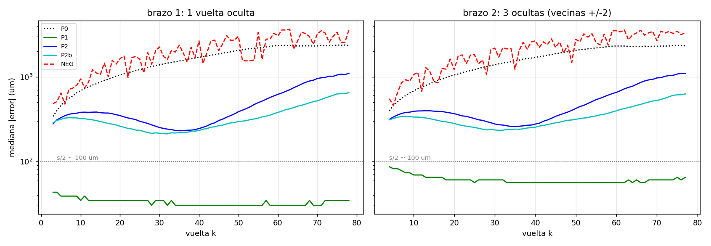

# 17 — The ironing field: one folding law for all of PHerc. 1218

*Moved unchanged from the README on 2026-09-06; the README now holds only the summary. Figures and scripts are referenced relative to the repository root.*

**What it does.** Tests whether the crush relief of the whole scroll is
separable — Δr(winding, θ, z) ≈ A(winding) · F(θ, z) — i.e. whether all
windings share ONE master fold pattern, each with its own amplitude. If
they do, the folding law becomes a predictor: in the wedges where
segmentation dies (mode 16 census), the sheet's radial position can be
predicted from the pattern, calibrated on the surviving rims of that same
winding.

**Method.** F = median across windings of the per-winding normalized
relief; A per winding by least squares. Exams, criteria fixed before
running: (1) a synthetic self-test inside the cell (fitter must recover a
planted law: corr ≥ 0.90, wedge ratio ≤ 0.60 — PASS at 0.990 / 0.52; a
negative bench with per-winding random phase yields 0.98 = the instrument
does not manufacture leverage); (2) the wedge exam on real data: for each
tested winding, F is fit *without* it, its A from its rim cells only, and
the prediction is scored on the census wedges (RMSE/σ; ≤0.70 = leverage,
0.70–0.90 = weak, >0.90 = no law).

**Result.** Leverage, by the prefixed criterion: wedge ratio 0.58
[p25 0.46, p75 0.69] over 35 windings — inner half 0.46, outer half 0.62
(the use case: still below 0.70). Full fit: median R² = 0.68 per winding
(~0.85 in the body, declining outward). The shared pattern removes 42% of
the global relief in-sample (±1.26 → ±0.72 mm). Amplitude A(k) is a
bell: ~0.2 mm at the core, peaking at ~1.17 mm around winding 42–45,
falling to ~0.43 mm at winding 79 — the crush wrinkles hardest at
mid-depth. In practice: where segmentation sees nothing, the field cuts
the radial uncertainty roughly in half (~±1.3 → ~±0.8 mm).

**Figures.**

*The master fold pattern F(θ, z): the wrinkle all windings share. The
coherent vertical structure at θ≈180° is the fold crease — the same
meridian the coverage census (mode 16) shows as a dead line.*

*Fold amplitude A(k) (red) and variance explained R² (blue) per winding.*

*The unrolled ribbon before and after removing A(k)·F(θ, z): what the
iron does not explain is local damage plus the second-order term.*

**Limitations.** Places geometry, does not produce ink. Angular resolution
is the table's 6° binning — a guide, not letter-level. The residual grows
outward (R² ~0.85 in the body → ~0.3 at winding 79); the first candidate
for that residual is phase drift between windings, a declared next step,
not part of this fit.

**Artifacts.** `planchado_1218.npz` (the full field Δr̂ plus geometry and
per-winding quality) and `planchado_1218_results.json` (exam numbers) —
produced by the export cell in `scripts/planchado_1218.py`.

### Mode 17, addendum — the same law re-examined in microns

*Evidence: `REAL-DERIVED` — leave-one-winding-out, prefixed criteria,
shuffled control.*

The wedge exam above scores in units of σ. A segmenter asked the fair
question in his own units: **how many microns?** So the field was
re-examined by hiding windings and predicting their radial position bin
by bin, in µm, against a local sheet separation of ~0.2 mm (the run
prints the measured median).

Two arms, criteria fixed before running: hide one winding (arm 1) or
three (arm 2, neighbours at ±2). Four predictors: P0 the ideal spiral
(floor), P1 interpolation from the surviving neighbours, P2 the held-out
ironing field, NEG the same field with its θ-dependence shuffled.

| predictor | arm 1 (1 hidden) | arm 2 (3 hidden) |
|---|---|---|
| P1 neighbours | **32 µm**, 88% in the right gap | **60 µm**, 68% |
| P2 held-out field | 370 µm, 16% | 387 µm |
| P0 ideal spiral | 1717 µm, 5% | 1719 µm |
| NEG shuffled | 1954 µm, 4% | 2232 µm |

**Result.** Exam A3 passes (P2 beats the floor in both arms) and the
control degrades as it should. But exam B3 — published whichever way it
fell — goes to **P1**: local coherence between adjacent windings is an
order of magnitude deeper than the global field approximation. Thirty-two
microns is below the table's own noise (<2 voxels) at one winding out,
sixty at two. That leaves the master fold pattern exactly one job: the
**wedges**, where the neighbours are missing too and P1 has nothing to
interpolate from.

**Fence, declared.** Bin resolution is 6° × 0.55 mm over median radial
positions, and only where segmentation exists. This is not per-voxel
tracing and it assigns no voxel to a sheet in contact — that is mode 18.

*Prediction error per predictor and arm, against the local sheet
separation printed by the run.*

**Script.** `scripts/planchado_heldout_um_1218.py`; arrays in
`archives/results/planchado/pl4_resultados_1218.npz`. A synthetic bench
with a planted law (20 µm noise) recovers the hidden winding at 14 µm —
the theoretical median of |noise| — against 362 for the floor and 477
for the shuffled control.

---

The full displacement field this iron corrects is measured point by
point — and the sheet rebuilt label by label — in mode 18.

---

