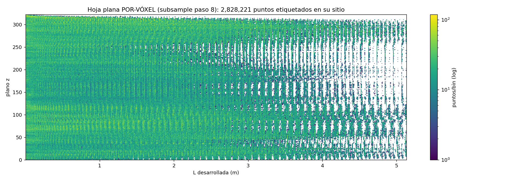

# 18 — The unwrap, v0: every label back to its origin

*Moved unchanged from the README on 2026-09-06; the README now holds only the summary. Figures and scripts are referenced relative to the repository root.*

**What it does.** Maps every crossing in the ray-crossing table (1.35M
points, windings 2–79) to its intrinsic position on the flat sheet
(developed length × height) and back onto an ideal pre-collapse spiral
fitted to the median radii (pitch 0.197 mm/turn, r0 0.97 mm). Nothing is
predicted or interpolated: where the table has no data, the sheet has a
hole, and the hole is information.

**Frame.** The table-to-volume frame is iyando's convention
(pitch_qa.py `ray_metrics()`), with per-slice origins from
origins_merged.csv (duplicates deduplicated by averaging; global
CT↔labels offset (−3,−1) voxels). Cross-validated two ways: our blind
self-registration recovered the mid-slice origin to ~10 voxels before
knowing it, and the duplicate statistics reproduce the published ones
exactly.

**Figures.**

*The flat sheet: label presence (top; holes = wedges, damage, lost
segmentation, drawn by absence) and per-point radial displacement vs the
ideal spiral (bottom) — the collapse of PHerc. 1218 measured point by
point: median 1.2 mm, 95th percentile 5.9 mm.*

*The scroll rewound to its ideal spiral, color = how far each point
travelled in the collapse. The bright horizontal rays and dark vertical
ones are the vertical crush seen from the original state: the long axis
moved out, the short axis moved in.*

*CT intensity carried onto the unwrap. This shows density and damage
mapped on the sheet — not ink: at 17 µm the layers are in full contact
and single-ray brightness carries no layer-locked signal (flat
anchor-stacked profile; radial decorrelation length ~50–70 µm, not
anchored to the crossings). The per-winding vertical patterning growing
outward is the rim/face alternation of the census (mode 16).*

*The receipt for the brightness null: a band of winding 35 rendered on
the anchored surface (top), the same render displaced half a layer
pitch — where the neighbouring sheet would be (middle), and their
difference (bottom). The two renders share all large-scale structure
(density, damage — note the dark streak, a candidate radial crack) and
differ only in fine-scale noise: brightness does not know which sheet
it is on.*

*Radial decorrelation of the render: correlation decays gradually
(0.86 at 17 µm, floor at half a pitch), so radial structure with
~50–70 µm coherence does exist — it is simply not locked to the sheet
crossings. Documented for future work at finer scales.*

**Numbers.** 1,348,078 crossings mapped; displacement |d| median
1.21 mm, p95 5.85 mm; ideal spiral pitch 0.197 mm/turn. The reliable
domain converges with the coverage census (mode 16): windings 2–66,
L ≈ 4.1 m — two independent instruments agreeing on where the data ends.

**Limitations.** Angular resolution is the table's 6° binning; developed
lengths from median geometry; the wedges are holes, not predictions (the
ironing field of mode 17 predicts them separately, with its own measured
error). Texture is density/damage, not letters — the brightness null is
documented above and in the exam chain.

**Next.** With per-voxel labels the same mapping yields the
full-resolution unwrap, a per-point sheet-thickness map in flat
coordinates, and a geometric QA of the labels themselves (self-overlaps
and sheet-switches become visible artifacts in flat space) —
conversation opened with the labels' author.

**Scripts.** `scripts/unwrap_labels_1218.py` (presence + displacement +
restored scroll), `scripts/unwrap_texture_1218.py` (CT intensity on the
unwrap). Both need only the crossing table; the texture script also
reads the L1 volume.

---

### Mode 18, v0.5 — the per-voxel unwrap (step-8 subsample)

*Evidence: `REAL-DERIVED` + `THIRD-PARTY` data (Jinhojeong's labelled 
points, Kaggle) — supported; one design correction documented below.*

**What it does.** Assigns a winding number to every labelled voxel of
Jinhojeong's step-8 subsample
([pherc1218-label-points](https://www.kaggle.com/datasets/jhjeong0815/pherc1218-label-points),
14.8M points, pre-repair stitch — the same volume the crossing table was
cast from) by bracketing each point between the crossing-table radii on
its own ray (θ, z). Two prefixed acceptance criteria, both passed:
85.8% of points assigned without ambiguity (criterion ≥60%), and a
median |Δr| to the assigned crossing of 2.61 voxels = 45 µm (criterion
≤3 voxels; sheet thickness is 6–12 voxels). Registration checks came
out clean: lattices aligned (|Δz| = 0), and the best in-plane offset is
(0,0), confirming the labels and the table share one frame.

*2,828,221 labelled voxels, each at its own place on the flat sheet.
No point is predicted or interpolated. The map independently reproduces
the anatomy the coverage census (mode 16) drew from the ribbon: solid
interior to L ≈ 2.5 m, growing wedge combing beyond it, and the die-off
toward L ≈ 4–5 m.*

**Label QA, two-way.** Instances were the wrong unit for winding
assignment — see the correction below — but they are the right unit for
QA: a legitimate instance is a piece of the spiral, so its assigned
windings must form a consecutive run. 20,494 of 73,899 instances
(27.7%) show a winding gap ≥2 with ≥3 points on each side — the same
order as the ~17% seam merge-fault rate the labels' author measured on
his side. Per the protocol agreed with him, these are **candidates for
either side being wrong until checked against the CT** — some will be
his seams, some our assignment errors, possibly some real extreme
folds. The list ships as `qa_instancias_1218.csv`. Declared limit: a
switch to the *adjacent* winding (gap = 1) is indistinguishable from
legitimate continuation at this subsampling.

**Documented design correction.** The first version (VOTE-1) assigned
windings by majority vote per instance. Its prefixed purity exam
returned REVIEW (median purity 0.15; one instance drew 176,859 votes)
and stopped the result: the scroll is one spiral sheet, so a
well-stitched instance *must* span many windings — purity measured
topology, not error. The unit was wrong, not the data. The per-point
version above replaced it; VOTE-1 is kept in `scripts/` as the recorded
correction.

**Scripts.** `scripts/winding_per_point_1218.py` (per-point assignment,
QA, per-voxel flat sheet); `scripts/vote_instance_winding_1218.py`
(superseded, kept as documented correction). Both need only the
crossing table plus the public Kaggle subsample. Next: the same
assignment over the full-resolution labels (script offered to their
author), which adds the per-point sheet-thickness map.

---

