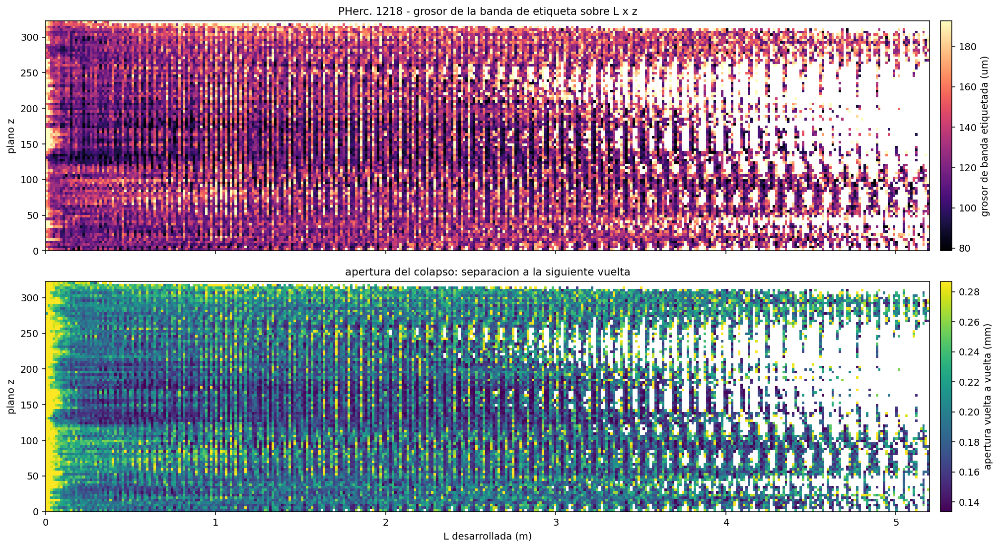
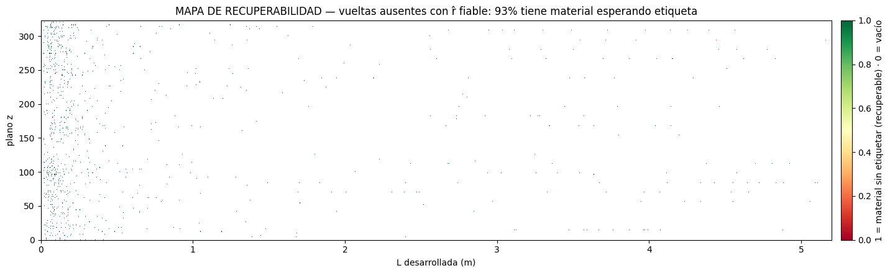
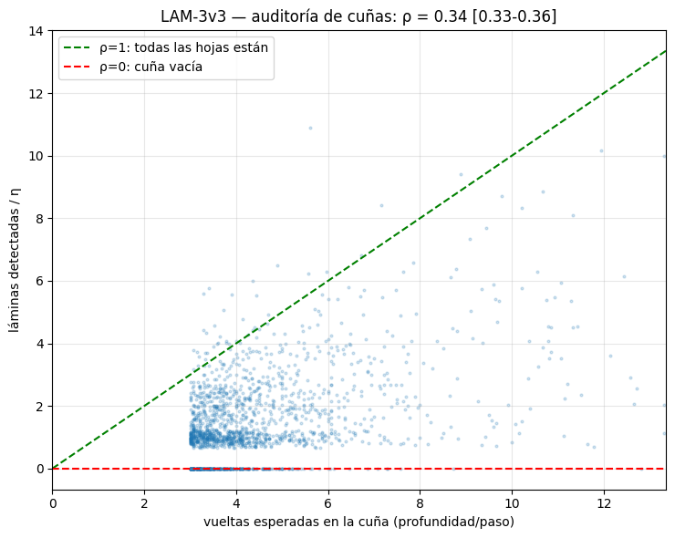

# 19 — The recovery map: is the missing scroll lost, or only unlabelled?

*Moved unchanged from the README on 2026-09-06; the README now holds only the summary. Figures and scripts are referenced relative to the repository root.*

*Evidence: `RAW CT` with a control arm — two prefixed exams passed, one
design error caught and recorded.*

**The question.** Roughly 40% of PHerc. 1218 has no segmentation. The
coverage census (mode 16) shows where, but not *why*: is the papyrus
destroyed, or is it sitting there unlabelled? Those two answers ask
different things of the people doing the segmenting, so the difference
is worth measuring rather than assuming.

The winding maps make it measurable. Where a winding is absent between
two present neighbours, mode 17's held-out interpolation places it to
32–60 µm. Sample the raw CT at exactly that radius and ask whether there
is material there.

### Thin gaps: the material is there

**Method.** For every absent-winding position with present neighbours
(dk ≤ 3), sample the raw CT at the interpolated radius. **Control arm:**
sample present windings the same way; the threshold is the control's 5th
percentile, printed before it is applied.

**Result.** **92.7%** of sampled positions carry material — median
brightness 145 against the control's 143, threshold 100, stable across
dk = 1/2/3 (92.6 / 94.1 / 94.5%). A companion check (LAM-1) had already
shown these are not windings quietly swallowed by a fat neighbour: of
10,612 gaps in one winding, only 5.4% fall inside a neighbour's label,
and those neighbours carry no excess thickness.

Combined, that yields **9,034 predicted missing-label positions with
raw-CT evidence of material** — shipped as
`archives/results/recovery/unlabeled_material_1218.csv`
in the labels' author's own frame, as falsifiable claims: his repaired
v2 labels either cover them (mutual confirmation by independent routes)
or they do not (our error, and we want to know).

The hole is in the drawing, not in the snail.

### Wedges: the mass survives, the structure mostly does not

Thin gaps are the easy case. The census wedges — where a whole run of
windings is truncated — are the hard one, and interpolating across them
would be inventing. So they were **audited** instead of filled: count
mass and count laminae, assign nothing.

**Method.** In each column, a wedge runs from the last crossing to the
scroll's real edge in the masked CT. Laminae are counted by peak finding
on the smoothed radial profile — *detected in the CT, never interpolated* —
with the counter **self-calibrated on the labelled stretch of that same
column** (η = ridges per known winding).

**Prefixed exams.** E1: median η between 0.3 and 1.2 → **PASS at 1.06**
(IQR 0.92–1.21) — the counter reproduces what is known. E2: split-half,
the inner half must predict the outer within 25% → **PASS at 16.4%**.

**Result.** Over 1,672 auditable wedges (≥3 expected windings): material
fraction **0.85**, but resolvable-lamina ratio **ρ = 0.34 [0.33–0.36]** —
2,671 laminae resolved of 7,822 expected, distribution p10 0.00 / p50
0.30 / p90 0.70. The wedges keep the papyrus and lose most of the
partitions: about **one sheet in three is still resolvable as a lamina at
17 µm**. The rest is fused mass — not necessarily destroyed, but with no
testimony at this resolution. The synthetic bench anchors the reading: a
planted full wedge audits at ρ = 1.02, an amorphous mass with no laminae
at 0.29. The real scroll sits beside the amorphous bench, not the full one.

### Placing what can be placed

The resolvable laminae in each wedge were then exported as new crossings
in the table's own format, ordered by the spiral, behind three locks:
spacing within 0.5–2.5× the local pitch (cut at the first violation),
brightness ≥60% of that column's known ridge median with a prominence
floor, and continuity with neighbouring columns. Mass with no ridges is
exported as a **declared range**, not carved into invented sheets.

**Result (amended 30-08 — see LOGBOOK):** 281 new crossingsat full z-resolution,
**since downgraded to candidates**; the **0.36 m of ribbon is no longer claimed**
— plus 3,804 mush blocks bounding ~667 winding-equivalents. Exam E3 passes 
(median pitch within 25% of the labelled one). **Exam E4 failed at stride 2** and 
is reported as such:
with isolated laminae, one per column, the random control matched the
real rate. Doubling the z-sampling gave the isolated ridges neighbours to
confirm against and lifted the count 2.7×; the 1,697 that never
found a neighbour stay candidates and are **not** exported as crossings.

### A design error, caught by its own exam

The first version of the wedge audit looked for absent windings *between*
two present ones by index — and returned zero. The index `k` is the
ordinal of a ray crossing, not the identity of a winding: interior gaps
in `k` cannot exist by construction. Absences live as **truncation** (the
census wedge pattern) and as shifts from fusion. The exam meant to
calibrate the counter caught it before any verdict was published; the
audit was rebuilt around wedges, which is what it should have been.

*Label thickness (top) and winding-to-winding aperture (bottom) over
developed length and height, median-aggregated per cell. The open core at
L < 0.15 m, the tight band through the first metre, and the loosening
toward the top and bottom of the roll. Descriptive only — no exam rides
on this figure. `scripts/anomaly_map_1218.py`, rebuilt from the public
winding maps.*

*Where the absent windings still have material in the CT.*

*Detected laminae (slope-corrected by the per-column calibration η)
against the windings each wedge should hold. ρ = 1 is the green line —
every sheet still resolvable; ρ = 0 the red one. The cloud sits at
0.34.*

*Where the wedges keep their sheets: ρ per column over θ and z.*

**Scripts.** `scripts/recovery_probe_1218.py` (thin gaps, with the
control arm) and `scripts/wedge_audit_1218.py` (mass and lamina audit,
with E1/E2). Artifacts in `archives/results/recovery/`.

**Declared limits.** Thin gaps only where both neighbours survive; wedges
are audited, never interpolated. And the control answers a narrower
question than the section's title: sampling present windings shows that
the predicted position **is not air**, not that *the missing winding is
there*. In a crushed region almost any nearby radius carries material.
The control that would separate the two is an **off-layer arm** —
resample at ±½ pitch and at random comparable offsets, and require the
predicted position to hold more laminar signal than its own displaced
copies. That arm has not been run, so the claim here stays at *material
present*, not *missing winding identified*. Under full contact the honest wording is
*candidate unsegmented sheet*, not *sheet*. Assigning brightness-coherent
laminae to specific windings is the declared next step, not a claim made
here.

---

---

## Note (8 Sep 2026) — a floor in the lamina counter

The wedge audit's ridge detector required peaks at least 6 voxels (~100 µm) apart, so laminae packed tighter than that could not be counted at any resolution. The "resolvable laminae" ratio of 0.34 carries that floor and should be read as a lower bound on what a counter without it would find. The floor was found on a synthetic twin before the follow-up experiment (`wedge_fine_1218.py`) ran; that experiment then stopped at its first exam because, floor or not, half the known sheets at 17 µm have no valley to detect. Mode 20 takes the question up by a different route.
