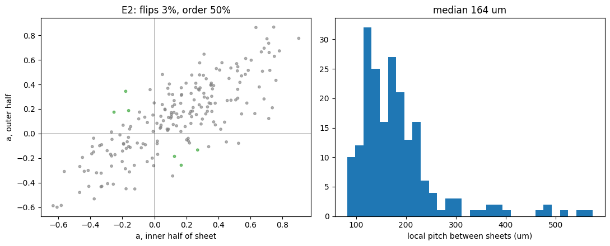
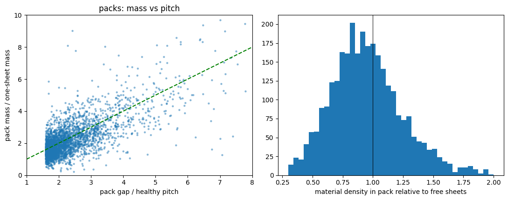
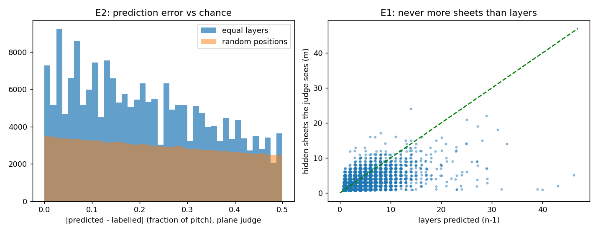
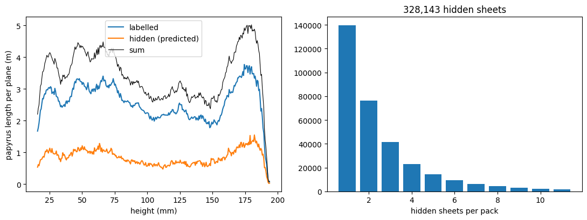
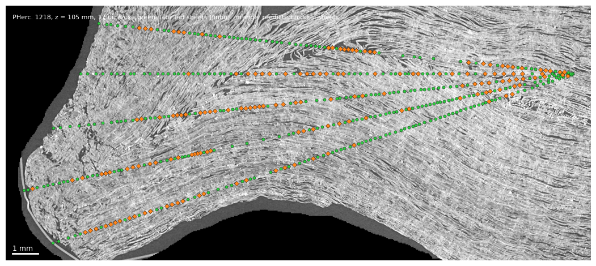

# 20 — Hidden sheets at normal pitch: where the unlabelled papyrus is, sheet by sheet

*Added 8 September 2026. Scripts: `layer_division_1218.py`, `layer_compression_1218.py`, `mass_count_1218.py`, `hidden_sheets_1218.py`, `fibre_parity_1218.py`, `fold_check_1218.py`, each with a `*_twin_1218.py` bench. Data: Jinhojeong's crossing table and origins for PHerc. 1218; CT levels 0 and 1 from the public bucket.*

## Where this comes from

The census of PHerc. 1218 (mode 16 and its metrology addendum) left an uncomfortable number on the table: the roll's loom is 8.4–9.4 m long, but only about 3.2 m of it per plane carries a label. The wedge audit (mode 19) then showed that most of the unlabelled material is physically present — the CT sees papyrus where the labels see nothing — but at 17 µm it could not be resolved into separate sheets. The question this mode answers is the obvious next one: *where exactly are those sheets, and can we say so with a judge that is not ourselves?*

The week that produced the answer is worth telling in order, because three of the four things we tried failed, and the failures are what make the result trustworthy.

## What failed first

**Fibre texture (mode 15 re-run, 7 Sep).** The August run of the striation check on 1218 had read the origins file by column position — the file lists `z, cy, cx` — so the centre was 2 mm off and the CT offset was missing. Re-run with the origins read by name, the material sanity check went from 88 % to 100 % and the result did not move: no striation band at 2–6 mm (below the shuffled null), no fine-grain band. At 17 µm the sheets of this scroll carry no fibre texture. What worked on Paris 4 does not transfer.

**A fibre-parity marker (fibre_parity_1218.py, 7 Sep).** A papyrus sheet is two crossed layers of strips, and in a roll every sheet faces the same way, so walking outward through a pressed stack the fibre direction should flip once per sheet. At 8.6 µm (CT level 0) there *is* a visible grain direction (median anisotropy 0.24 against a null of 0.12), but it does not flip inside a sheet: 3 % of 202 known sheets show a flip, at chance level, and the grain is the same in a sheet, its neighbours and the material between them. The grain is a property of the place, not of the sheet. Before this could even be read, a diagnostic run had shown that at 8.6 µm the material around 99 of 120 known sheets runs unbroken for more than 250 µm: the labelled sheets are pressed together with no valley between them. Sheets in this scroll cannot be delimited by brightness at any resolution we have.

*Left: grain direction in the inner and outer half of each known sheet — the points sit on the diagonal, never across it. Right: local pitch between consecutive labelled sheets, median 164 µm.*

**Zone compression (layer_compression_1218.py, 7 Sep) and mass (mass_count_1218.py, 8 Sep).** Once the first positive result (below) was in, its residual error looked like compression: in some packs the neighbouring plane saw more sheets than expected at the normal pitch. Two explanations were tested. Compression mapped by angle and depth is flat — about one pack in four looks pressed, in every direction and at every depth alike — so a zone correction gains nothing, on a held-out half of the planes. Counting sheets by CT mass instead of pitch (the premise being that a quality papyrus carries the same material per sheet everywhere) gives *exactly* the same answer as the pitch, and the material per unit length inside packs is 0.93 of the free sheets. Packs are not pressed sheets. The premise of constant mass is probably true, but there is no compression for it to reveal.

## What survived

**Equal division at the normal pitch (layer_division_1218.py, 7 Sep).** On a ray, where two consecutive labelled sheets are further apart than 1.6× the local pitch (the median of the normal gaps around them), the gap is a pack holding n − 1 sheets, n = round(gap / pitch), at equal spacing. The judge is the same ray one plane up and down (0.55 mm): the two bounding sheets are matched by nearest radius, and any labelled crossing the judge sees strictly inside the matched interval is a hidden sheet made visible. The judge sees at least one in 145,000 of 214,000 packs.

The predicted positions land a median 35 µm from where the judge sees the sheets — 0.22 of a pitch, against 0.46 for random positions inside the same gap — and 54 % of the seen sheets fall within a quarter pitch of a predicted layer (random: 29 %).

The count exam, however, failed by a hair (89.5 % against the 90 % required): in 10.5 % of packs the judge saw *more* sheets than predicted layers. This is what sent us into the compression and mass detours above. The actual cause turned out to be a known artefact of the labels: 31 % of consecutive crossings in the table are one label cut in two, less than 7 voxels apart (metrology addendum, mode 16). A split label in the judge plane counts as two sheets. With crossings closer than 7 voxels merged before the search, the judge sees more sheets than layers in **2.0 %** of 240,000 packs, and the count exam passes. Four fifths of the "excess" were split labels.

**The list (hidden_sheets_1218.py, 8 Sep).** With the rule settled — merge split labels, local pitch from the normal gaps, packs above 1.6×, equal division — the full list follows from the table alone in half a minute: **328,143 predicted sheets in 204,302 packs on 323 planes**, one row per (plane, ray) crossing in the table's own frame. The file is `archives/results/for J/hidden_sheets_1218.csv` (z, theta_deg, r_l1_vox, r_um, k_inner, k_outer, n_in_pack, material).

Against the CT at 17 µm, 97.6 % of the predicted sheets sit on material; the labelled sheets themselves give 99.4 %. The 2.4 % off material are flagged row by row and are most likely voids. The midpoints between predicted sheets also read 97.5 %: inside a pack the CT is solid, so this check rules out holes but says nothing about position. Position rests on the neighbouring-plane judgement above.

*Left: papyrus length per plane along the roll's height — labelled (after merging split labels), hidden at normal pitch, and their sum. Right: hidden sheets per pack; most packs hide one.*

## Limit: folds. Crossings are not windings

The section below is the picture that Paul's standard asks for — the CT itself with the geometry on top — and it is also the picture that shows where this mode stops. It is one plane of PHerc. 1218 at 105 mm height, five rays 6° apart, labelled sheets in green and predicted hidden sheets in orange.

*z = 6064 (105 mm), rays 162°–186°, 17 µm/voxel, 1 mm bar. Green: Jinhojeong's labelled sheets (split labels merged). Orange: sheets predicted at the normal pitch. 158 predicted crossings in this sector.*

Along the straight stretches the picture is what the numbers say: the orange diamonds sit between the green dots, on papyrus, at the same spacing. But look at the rim (upper left) and at the crumpled patches: there the sheets are not straight, and a horizontal plane cuts an undulating sheet two, three or four times. Diego's image for it is a surfboard cutting several waves of the same water. Each cut is real papyrus — the CT check is not wrong — but neighbouring crossings on a ray can then be the *same* winding folded, not two windings. The 328,143 rows are therefore **crossings of papyrus, not windings**. In the body of the roll, where sheets run straight, the two coincide; in the folded zones they do not, and the count of windings between two labelled sheets there is unknown.

We tried to separate the two from the table alone (`fold_check_1218.py`). A wave-fold pair moves with height: going up or down the plane, its two crossings approach, meet and vanish, whereas two windings keep their spacing. Tracking every crossing through the neighbouring planes and flagging pairs that close or vanish catches, on a twin with planted waves, 38–60 % of the fold crossings at the cost of 7–11 % of true windings flagged by mistake. That is not good enough to certify crossings one by one, and the reason is structural: once split labels are merged (they must be, 31 % of the table), a fold pair near its apex is already a single crossing, and the open part of the wave is indistinguishable from a missing label. A crease that runs the whole height of the roll (a Z-fold at a hinge) is not separable this way at all. The script is kept as a map of fold-prone zones, not as a certifier.

The question belongs to the per-voxel label tree, where a wave is one surface and there is nothing to guess. That is the next step, and it is the labels' author's to take with the list above.

## What it means, and what it does not

Per plane the labels cover 2.57 m once split labels are merged; the hidden sheets add 0.81 m; together 3.37 m against a loom of 8.4–9.4 m. So the packs between labelled sheets account for about a quarter of the missing papyrus, and they are a uniform phenomenon: the hidden length tracks the labelled length at roughly a third all along the height, with no damaged zone where it spikes. The remaining five metres are not *between* labels but *beyond* them — rays on which the labelling stops before the core or the rim, where there is no second labelled sheet to bound a pack. This is the same picture the labels' author found from the tree (angular coverage per winding has p10 = 0: the inner and outer lanes are nearly empty). The present rule cannot reach there; extending it needs the shape of each winding from the neighbouring rays (the per-winding atlas proposed in mode 17's addendum).

Two things this mode does **not** claim. It does not certify that each predicted sheet is a separate physical sheet — the 6° theorem of mode 19 still holds for the table, and the CT cannot separate pressed sheets by brightness. What it claims is narrower and checkable: wherever the labels do see into a pack, they see sheets at the normal pitch, equally spaced, within 35 µm of the prediction, and never more of them than the prediction allows once split labels are discounted. And it does not measure sheet thickness in microns: 121 µm at half peak was obtained on the 30 isolated sheets out of 202, with a brightness rule that is a convention.

## Two corrections to earlier modes

- The wedge audit (mode 19) counted "resolvable laminae" with a ridge detector whose minimum peak distance was 6 voxels (~100 µm). Sheets packed tighter than that could not be counted at any resolution; the audit's ratio of 0.34 carries that floor. Found on the twin of `wedge_fine_1218.py` on 6 Sep, before that experiment ran (it then stopped at its first exam: the same detector finds only half the known sheets at 17 µm, because they have no valley).
- The August striation null on 1218 (mode 15) was measured with the swapped centre; it is now re-measured and stands.

## Twins

Every script here was run on a synthetic twin with planted truth before it touched the table or the scan, and the twins caught the design faults that would otherwise have been read as results: the 100 µm counter floor; scanner noise faking ridges once the floor was made physical; an interpolation bias that gave smooth sheets a "direction"; layer mixing on tilted sheets; and the fact that "exact agreement with the judge" rewards under-counting because the judge misses sheets. Each twin's expected verdicts are in its docstring.
